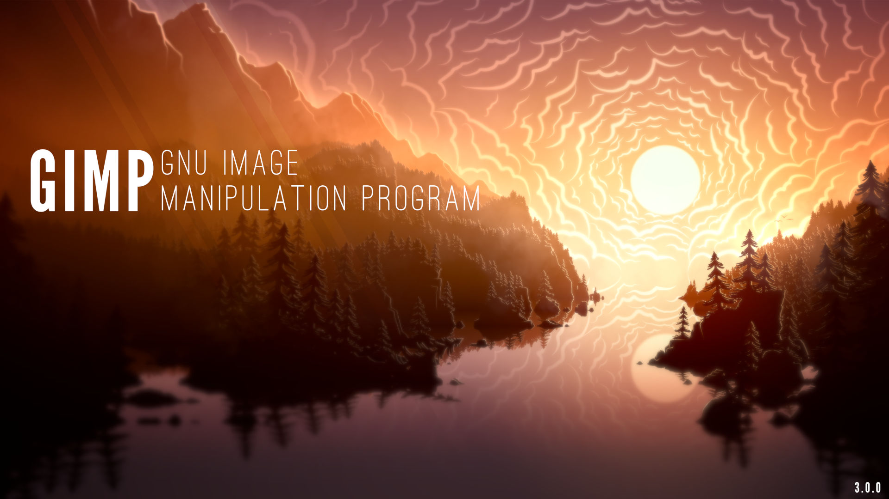
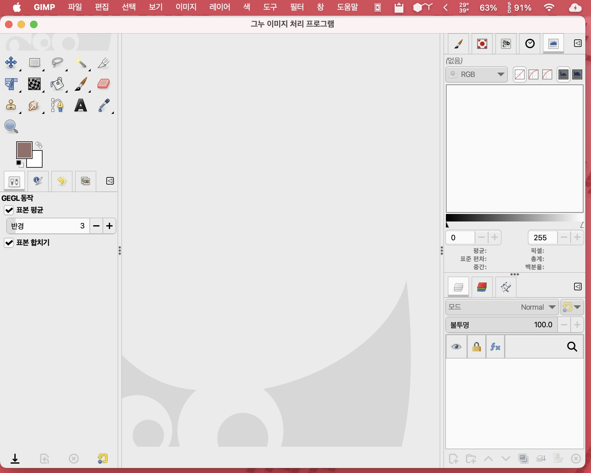

GIMP
===================================

GIMP란 뭘까?
--------------

**GNU IMAGE MANIPULATION PROGRAM** - GNU 이미지 처리 프로그램이라고 불리는 오픈소스 계에서의 포토샵(레스터 이미지 생성, 사진 수정등등) 역할을 하는 프로그램입니다. 당연히, `Darktable <https://www.darktable.org/>`_ 이라고 하는 어도비 라이트룸과 비슷한 RAW 편집 프로그램이 있지만, GIMP의 경우 한글화가 좀 되어 있고 포토샵처럼 쓸수 있다는 것도 장점이군요. 이번 3.0부터는 필터를 적용하고 되돌릴수 없었던 문제를 해결한 비파괴 편집과 캔버스서 바로 미리보기가 가능하게 되었습니다.

GIMP는 여러 유명한 리눅스 배포판들이 설치될 때 딸려오는 프로그램이기도 하죠. 덤으로 오늘도 수많은 행정병들이 이걸 붙들고 머리를 싸매고 있기도 하죠. 스크린샷은 제 맥에서 찍은 스샷이네요.

무료로 가져다 쓰되, 규칙은 지켜라하는 오픈소스로 풀려있기에 다른 사람들이 개조할수도 있습니다. 예를 들어, 포토샵 단축키/레이아웃에 맞게 수정한 `PhotoGIMP <https://github.com/Diolinux/PhotoGIMP>`_ 란 놈도 존재하며, GMIC 같은 여러 플러그인을 추가할수도 있습니다.

중요한건 달마다 돈을 낼 필요가 없다는 것이고, 계속해서 활발하게 개발이 이뤄지고 있는 프로그램입니다. 리눅스 쪽에서 사진편집을 하고 싶다! 라고 하시는 분들이 많이 애용하고 있고, Youtube에는 GIMP를 사용하는 강좌들도 많이 있습니다. 2019년엔 한국에 책도 나왔군요. 근데 버전이 많이 차이가 나서 참고용으로는 좋을거 같습니다 네...

GIMP는 `GIMP 공식 사이트 <https://www.gimp.org>`_ 에 들어가셔서 현재 최신버전을 다운로드 받으실 수 있습니다.