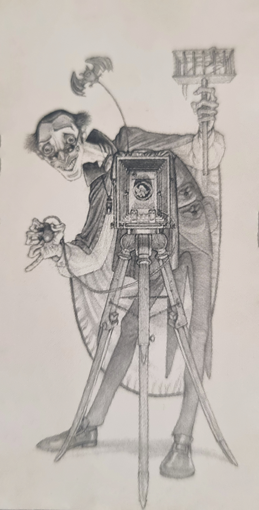

사진 기술 혹은 이론, 여담
===================================
이 사이트는 **사진 관련 기술이나 여담을 이야기하는 장소** 입니다.

수정을 원하시면 첫번째 방법으로는 `Github Pull Request <https://github.com/readingsnail/readthedocs-photo/>`_ - 혹은 링크에 적은 메일등으로 알려주세요.

내용은 수시로 변경될 수 있습니다. 간단하게 보고 넘기는 내용을 지향합니다.

필름 / 디지털 항목들은 이에 특화된 항목입니다. 예를 들어 필름의 ISO는 할로젠화 은 결정의 크기로 결정되지만, 디지털의 ISO는 또 다르죠. 특화된 항목이지만, 겹치는 부분도 존재합니다. 이렇게 둘다 묶을수 있지만, 곁다리로 볼수 있는 항목은 기타에 배치했습니다.

간단하게 보자면 흑백 필름을 주로 만드는 영국 일포드(Ilford)의 `친절한 설명 <https://youtube.com/playlist?list=PLarwq93oldzTPKIn4-RMP6w9_khSkuD-I&si=jDno_2dNHvG-EST0>`_ 도 있어요. 5화까지만 보시면 됩니다. 어도비에서 만든 `잘 찍는 구도 등의 설명 <https://www.adobe.com/kr/creativecloud/photography/discover.html>`_ 도 보면 괜찮겠군요.

사이트 전체의 저작권 알림
--------------------------

.. raw:: html

     </a>

특정 그림들을 제외하고 (`참고 <https://github.com/readingsnail/readthedocs-photo/blob/main/docs/source/images/copyright.txt>`_), 사이트의 내용물들은 달리 정하지 않는 한 **저작자표시-동일조건변경허락 4.0 국제 라이선스** 를 따릅니다. `전체 법적 라이선스 내용 <https://creativecommons.org/licenses/by-sa/4.0/legalcode.ko>`_ 은 여기를 참고해주세요.

더 깊은 이야기는 `저작권 <https://photo-technic-tmi.readthedocs.io/%EC%A0%80%EC%9E%91%EA%B6%8C.html>`_ 항목을 봐주세요.

가능한 이용
~~~~~~~~~~~~~~~
* 복사 및 배포를 할 수 있습니다.(반드시 저작자 및 출처를 표시해야 합니다.)
* 상업적 이용은 당연히 가능합니다.
* 이 저작물을 변경하거나, 이용해 2차 저작물을 만들어도 됩니다.(반드시 원저작자 및 출처를 표시해야 합니다.)

제한된 이용
~~~~~~~~~~~~~~~~~~~~~~~~~
* 2차 저작물에 원저작물과 동일한 라이선스를 적용해야 합니다.

사진이란 뭘까?
-----------
사진의 한자 뜻(寫眞)인 진짜를 베끼다(자세한 것은 `아우라 <https://photo-technic-tmi.readthedocs.io/%EA%B8%B0%ED%83%80.html#id7>`_ 항목을 보세요)보단, 이게 더 낫겠군요 - 위키백과 등에선 ‘빛, 즉 광자를 기록’ 하는 걸 말합니다. 영어의 Photography도 같구요. 광자를 기록한다로 정의하면 엄청나게 범위가 넓어집니다. 현 반도체 공정인 리소그래피(lithography)도 광자(현재는 X선쪽에 약간 포함되는 EUV)를 실리콘에 ‘노출’ 시켜 ‘인화’ 하는 과정을 반복하여 칩을 제작합니다.

생각도 하지 않았던 것들이 사진 범위에 포함되지만, 우린 그것들을 사진술이라 부르지 않습니다.

그래서 제가 좋아하는 판타지 시리즈인 디스크월드(Discworld)에 등장하는 사진과 사진술이 이 정의에 맞을거 같군요. 이 세계 최초의 관광객인 두송이꽃(Twoflower)이 Iconograph 란 상자를 들고 앙크 모포크란 그 세계관 최대의 도시에 관광을 처음 옵니다. 이 Iconograph는 임프에게 빨리 그림을 그리게 하는 살자였죠.

이후 두송이꽃이 가져온 그림 상자의 명칭을 따서 사진기와 사진술이 퍼졌고, 이런 사진을 좋아하는 사람 중에는 윗 그림의 앙크 모포크 타임즈 수석 사진기자인 뱀파이어 오토 크리엑(Otto von Chriek)도 있죠. 문제는 뱀파이어라는 점과 더불어 카메라의 샐러맨더 플래시를 터트리면 재로 변해버리는 터라 누가 피를 붓지 않으면(나중엔 깨지기 쉬운 유리병 목걸이에 동물 피를 넣어 다니게 됩니다), 시체 아니 그냥 재니까 말이죠. 그렇지만, 그렇게 되어도 사진기와 빛에 열광하죠.

여튼, 그렇습니다. 뭘까를 적었지만, 하고 싶은 이야기는 두송이꽃이나 오토 크리엑처럼 ‘와! 신난다! + 불사조 놀이가 싫지만 이미 빠졌는걸?‘ 이 본질이자 뭘까가 아닐까 싶네요. 원하는 사진은 누구나 다르니 말이죠

내용들
--------
.. toctree::
   :maxdepth: 5

   저작권
   사진기초
   필름
   디지털
   보정프로그램
   기타
