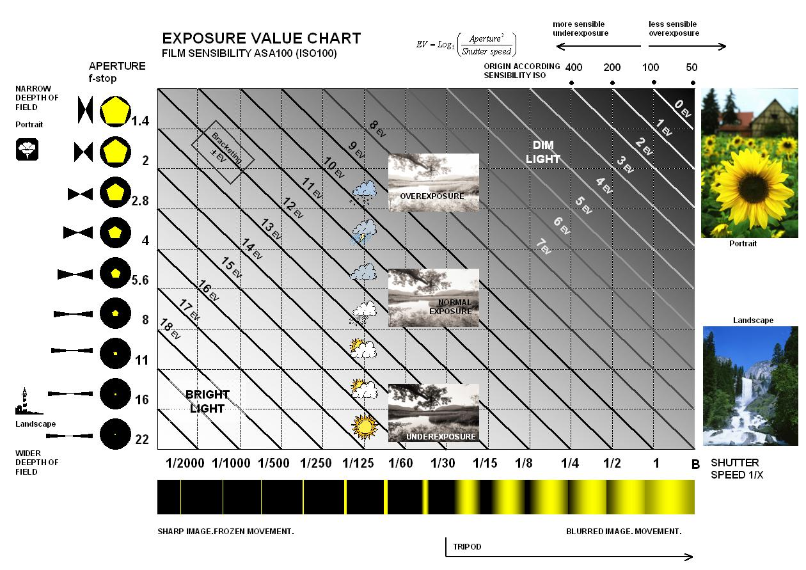
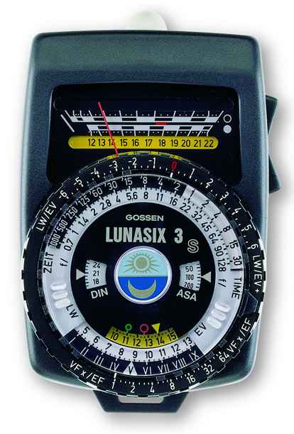
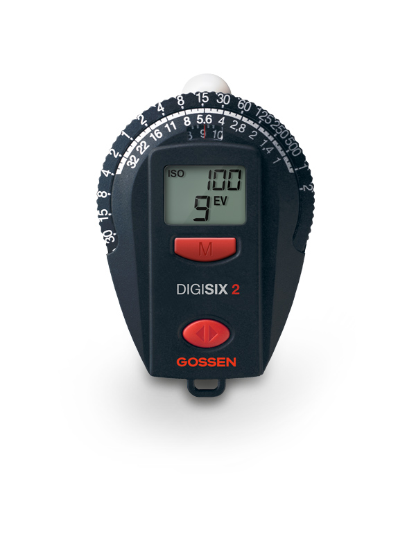

기타
===================================

Exposure value (EV)
---------------

그림을 추가했지만, 글로 설명하는게 낫겠군요

.. note::
**1 EV = 1 스탑**

그러니까, 카메라의 셔터 속도와 조리개 값의 조합을 나타내는 숫자입니다. 동일한 노출을 생성하면 같은 EV를 가져야 하죠. 숫자가 높을수록 빛이 강하다는 걸 의미합니다.

노출계의 변천
--------------------
직사 / 반사는 어짜피 뒤져보실거니까, 간단하게 볼만한 걸 올립니다. 물론 1932년 즈음 전자식 노출계가 개발되기 전에도 노출계는 있었습니다.

전자식 노출계는 3가지 부류가 있습니다.
#. 셀레늄 태양전지
#. 황화 카드뮴(CdS)을 사용한 포토레지스터
#. 실리콘 블루 셀(SBC), 혹은 실리콘

처음엔 셀레늄으로 만든 태양전지에서 비롯되었습니다. 태양전지인 탓에 들어가는 전기가 필요없었죠. 문제는 자외선을 받거나 혹은 그당시 기술로는 셀레늄 태양전지의 수명이 감소한다는거죠. 당시 셀레늄 태양전지는 수광부가 잠자리 눈 같거나 혹은 빛을 가리는 특성이 있습니다. 세코닉 노출계중 일부는 오랜시간동안 셀레늄 태양전지를 사용해왔습니다. 보다보면 상태는 멀쩡한데 노출값이 여엉인 경우가 있죠...

그 후에 황화 카드뮴으로 만든 포토레지스터가 등장합니다. 현재도 물감(카드뮴 옐로 등)의 재료로 쓰이는 황화 카드뮴은 빛을 받으면 저항이 줄어듭니다. 이걸 이용해서 포토레지스터를 만들었죠. 건전지를 넣기 시작한게 이때부터 이며, 소형화도 진행되었죠. 뭐 그러던가 말던가, 몇몇 소련제 카메라의 경우 포토레지스터의 시대이나, 셀레늄을 기어이 박아넣는 모습을 보여주기도 합니다. 또한 포토레지스터의 특성상 적외선 부분에 좀 더 집착하기도 했습니다.

실리콘 블루 셀, 혹은 실리콘은 포토다이오드 혹은 포토트랜지스터라 불리는 실리콘입니다. 지금도 비싸서 제대로 못쓰는 갈륨비소 실리콘이 여기 쓰입니다. 셀레늄처럼 발전은 못하는 대신, 특성을 가져왔다고 볼 수 있겠네요. 당연히 황화 카드뮴보다 더욱 작아졌고, 더 빠르고 정확하게 자동 초점을 쟀습니다. 여기부턴 '노출계' 라는 것이 그냥 사치품 혹은 부가 액세서리가 되었다고 볼 수 있죠.

아날로그 노출계 보는 법
--------------------
여기선 디지털이 아닌 아날로그 노출계 보는 방법을 설명하는게 나을거 같군요.

다른 아날로그 노출계나 세코닉이나 비슷하니 이걸로 설명하죠. 기종은 적혔다시피 독일 Gossen 사의 황화 카드뮴을 사용한 Lunasix 모델입니다.

eBay에서 사람 울릴려는 목적인지 모르겠지만, 아버지 유품을 팔면서 아버지가 매우 소중하게 여겼던(아버지 직업이 결혼식 사진 기사였다고 합니다) 물품이었다고 한 물건입니다. 유명한 롤라이 35에 들어간 노출계도 Gossen의 CdS 노출계구요.

여튼 중요한건, 위의 숫자가 아니라 아래의 원반입니다. 저 원반이 아날로그 컴퓨터 역할을 하죠.

#. ASA/DIN 은 필름 감도를 의미합니다. 투명 플라스틱에서 뭔가 튀어나온 부분이 보이시나요? 그걸로 필름 감도를 설정합니다.
#. 위에 나온 숫자나 바늘에 맞춰서 맨 바깥을 돌려줍니다. 여기선 노란색 화살표를 보는게 좋군요
#. 맞춘후 적정값을 파악합니다. 이 노출계는 조리개 값은 회전하지 않고, 셔터 스피드만 움직입니다. 여튼 보자면, f/2 에선 1/125 값이 노출에 맞습니다. 이건 각에 맞춰놓은거고, 이 125 값이 옆 f/2.8 의 영역 안에 들어가냐, 혹은 어느정도 거리(한 눈금차이)면 f/2의 값에 맞춰서 125 찍으면 됩니다.
#. 전 Sonnar f/1.5 렌즈를 가지고 있습니다. 여기엔 f/1.4 밖에 없잖아요? 하면, 적절하게 한 눈금정도 해석하면 됩니다.

이와 비슷한 방식이 Gossen Digisix 죠. 크기도 작고, 리튬전지 먹고 온도계등 기능도 많고...

사진은 Digisix의 개량판이라 일컫는 Digisix 2 입니다. 이것도 방식은 간단해요.

#. 직사/반사형에 따라 윗 덮개를 벗기거나 등등 한후 M 버튼을 누릅니다.
#. M 버튼을 누르면 EV 값이 나옵니다.
#. 이 EV 값에 맞춰서 딸깍 거리는 맛을 느끼면서 맞는 EV 값으로 돌려줍니다.
#. 그리고 위에 설명한것처럼 보시면 되죠.