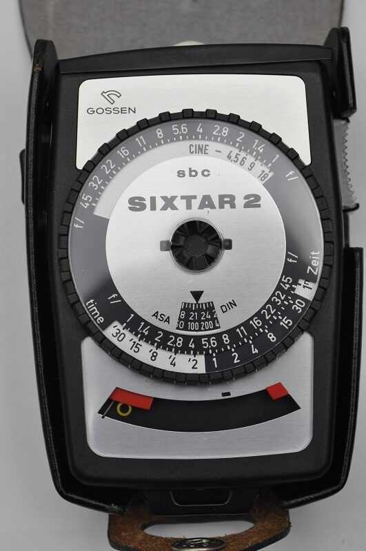

기타
===================================

Exposure value (EV)
---------------
.. image:: images/ev.jpg
 :width: 600

그림을 추가했지만, 글로 설명하는 게 낫겠군요

.. note::
**1EV = 1스탑**

그러니까, 카메라의 셔터 속도와 조리개값의 조합을 나타내는 숫자입니다. 동일한 노출을 생성하면 같은 EV를 가져야 하죠. 숫자가 높을수록 빛이 강하다는 걸 의미합니다.

노출계의 변천
--------------------
직사 / 반사는 어짜피 뒤져보실거니, 간단하게 볼만한 걸 올립니다. 물론 1932년 전자식 노출계가 개발되기 전에도 노출계는 있었습니다.

전자식 노출계는 3가지 부류가 있습니다.

#. 셀레늄 태양전지
#. 황화카드뮴(CdS)을 사용한 포토 레지스터
#. 실리콘 블루 셀(SBC), 혹은 포토다이오드나 포토트랜지스터

처음엔 셀레늄으로 만든 태양전지에서 비롯되었습니다. 태양전지인 탓에 들어가는 전기가 필요 없었죠. 문제는 자외선을 받거나 혹은 그 당시 기술로 만든터라, 셀레늄 태양전지의 수명이 감소한다는 거죠. 당시 사용된 셀레늄 태양전지는 수광부가 잠자리 눈 같거나 혹은 빛을 가리는 특성이 있었습니다. 그리고 세코닉 노출계중 몇 개는 오랜 시간동안 셀레늄 태양전지를 사용해 왔습니다. 그래서 시간이 지나서 보면 상태는 멀쩡한데 노출값이 이상한 경우가 많이있죠...

그 후에 황화카드뮴으로 만든 포토 레지스터가 등장합니다. 현재도 물감(카드뮴 옐로 등)의 재료로 쓰이는 황화카드뮴은 빛을 받으면 저항이 줄어듭니다. 이걸 이용해서 포토 레지스터를 만들었죠. 건전지를 이때부터 넣기 시작했으며, 소형화도 진행되었죠. 이때도, 몇몇 소련제 카메라의 경우 포토 레지스터의 시대였으나, 셀레늄을 기어이 넣는 모습을 보여줍니다. 포토 레지스터의 경우, 특성상 적외선 부분에 좀 더 집착하기도 했습니다.

실리콘 블루 셀, 혹은 실리콘은 포토다이오드 혹은 포토트랜지스터라 불리는 갈륨비소기반의 실리콘입니다. 이건 셀레늄 태양전지가 아니라, 특성을 가져왔다고 볼 수 있겠네요. 당연히 황화카드뮴보다 더욱 작아졌고, 더 빠르고 정확하게 자동 초점을 쟀습니다. 여기부턴 '노출계'가 사치품 혹은 부가 액세서리가 되었다고 볼 수 있죠. 요새는 아두이노를 가지고 셔터의 속도 측정에도 사용할 만큼 싸졌기도 합니다. 포토 레지스터의 경우 속도가 느려서 셔터 속도를 제대로 못 측정하는데 비해, 1ms 의 속도도 정확하게 측정해냅니다.

아날로그 노출계 보는 법
-------------------------
여기선 디지털이 아닌 아날로그 노출계를 보는 방법을 설명하는게 나을거 같군요. 가격도 싸기도 하고, 올드한 부분도 있으니 말이죠.

다른 아날로그 노출계나 세코닉등등이나 다 방법은 비슷하니 이걸로 설명하죠. 사진 속 기종은 독일 Gossen 사의 SBC, 그러니까 포토 다이오드를 사용한 Sixtar 2 SBC 모델입니다. 다른것보다 이게 더 설명하기 쉬운거 같아서 들고옵니다.

#. ASA/DIN 은 필름 감도를 의미합니다. 투명 플라스틱에서 뭔가 튀어나온 부분이 보이시나요? 그걸로 필름 감도를 설정합니다. 구소련제의 경우 GOST란게 적혀있을수 있습니다. GOST는 소련/러시아 표준이라 생각하시면 됩니다. DIN은 독일표준, ASA는 미국 표준이죠. ISO는 ASA에 맞게 돌려주면 됩니다. ISO 200 이면 ASA 200 이렇게요. 현재는 ASA 120, 그러니까 ISO 125 정도에 설정되어 있습니다.
#. 오른쪽 버튼을 어느정도 눌러 눈금을 움직이게 하고 겉 바퀴를 돌려 눈금에 노란 원이 정 가운데가 오게 맞춥니다. 당연히 배터리가 들어가야 하겠고, 입사식인지 반사식인지 확인해야 하겠죠? 밤같은 곳을 재기 위해서 오른쪽에 스위치가 있습니다. 내리면 더 어두운 부분으로 넘어가는 거죠.
#. 이제 측정한 적정 값을 읽어줍니다. 위의 CINE 값이 아니라 아랫 값이요. 조리개 값인 f값은 고정되어 있고, 셔터스피드가 움직입니다. 1 다음에 ` 표시가 없는것은 초단위 입니다. 그러니까, f/2 에선 1/8을 놯으면 되고, 이건 1/4까지 유지됩니다. f/2.8 에선 가까운 값인 1/4가 적정 노출값입니다. f/5.6 부턴 1초 이상의 노출값을 지닙니다.
#. 전 Sonnar f/1.5 렌즈를 가지고 있습니다. 그런데 여기엔 f/1.4밖에 없어서 어떻게 재나요? 하면 적절하게 한 눈금 정도 해석하면 됩니다. 이 사진에서 보자면 1/15 정도에 두고 찍으면 되겠군요.

이와 비슷한 방식이 Gossen Digisix죠. 크기도 작고, 리튬전지 먹고 기능도 많고...

.. image:: images/digisix2.jpg
 :width: 600

사진은 Digisix의 개량판이라 일컫는 Digisix 2 입니다. 이건 포토다이오드를 사용하지만, 방법은 위와 같습니다.

#. 직사/반사형에 따라 덮개를 벗긴후 M 버튼을 누릅니다.
#. M 버튼을 누르면 EV값이 나옵니다.
#. 이 EV값에 맞춰서 윗 창을 보면서 맞는 EV값으로 돌려줍니다. 점이 하나, 둘 나올겁니다. 이것도 표식이 있기에 그대로 해줍니다.
#. 다 맞춘후 위에 설명한 것처럼 보시면 됩니다.