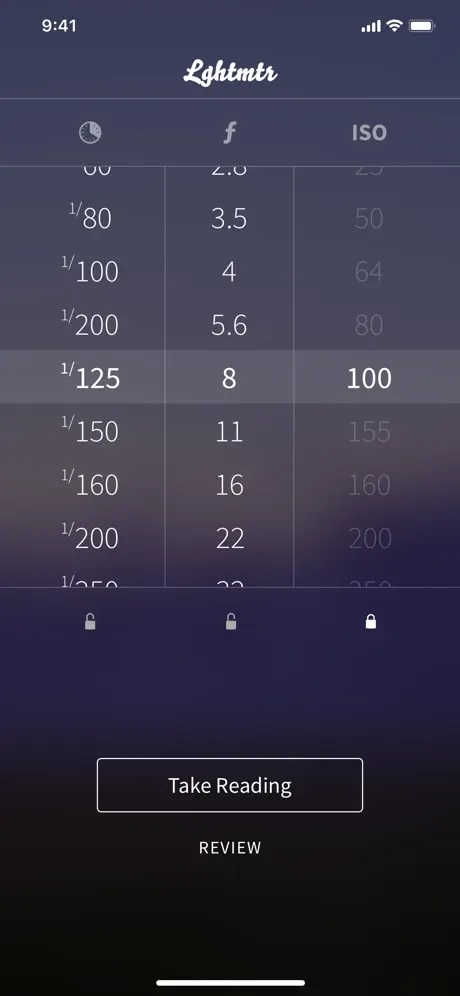
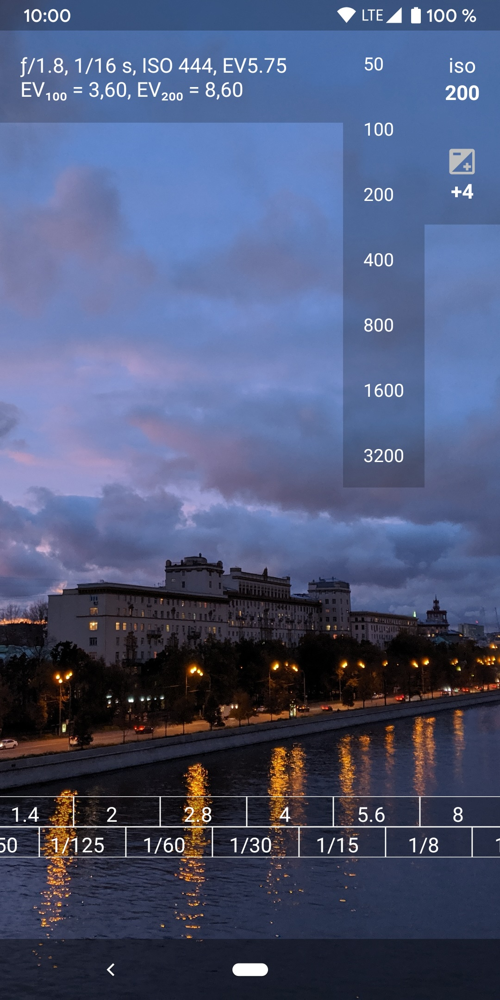
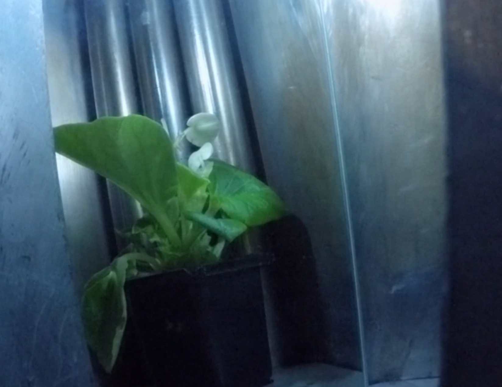
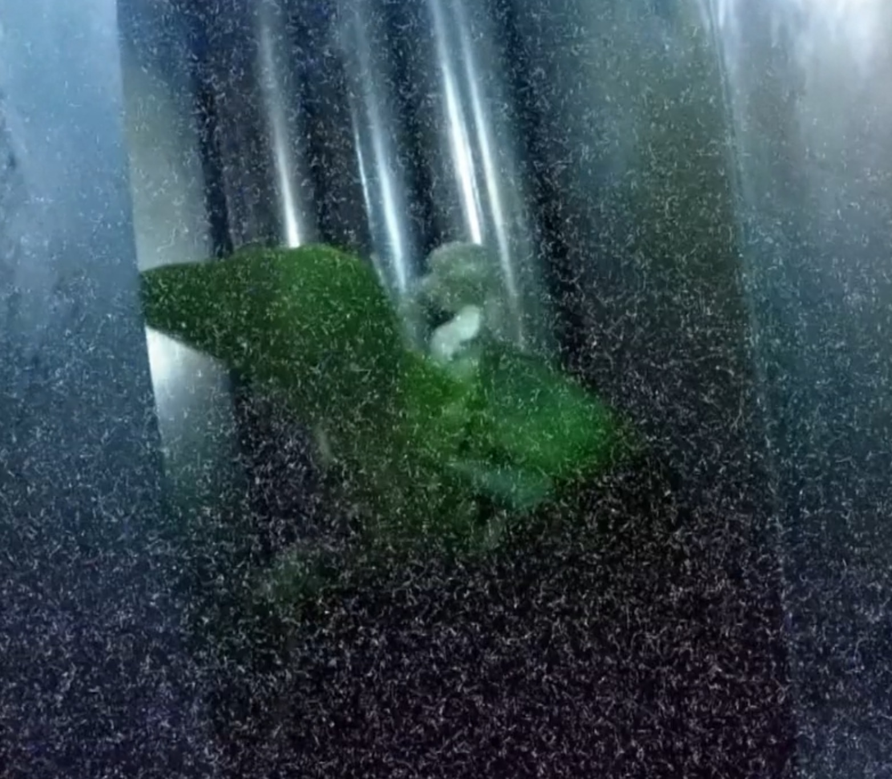

기타
===================================

Exposure value (EV)
---------------
.. image:: images/ev.jpg
 :width: 600

그림을 추가했지만, 글로 설명하는 게 낫겠군요

.. note::
**간단하게, 1EV = 1스탑 입니다.**

그러니까, 노출 계수란건 카메라의 셔터 속도와 조리개값의 조합을 나타내는 숫자입니다. 동일한 노출을 생성하면 같은 EV를 가져야 하죠. EV 숫자가 높을수록 빛이 강하다는 걸 의미합니다.

노출계의 변천
--------------------
직사 / 반사는 어짜피 뒤져보실거니, 간단하게 볼만한 걸 올립니다. 물론 1932년 전자식 노출계가 개발되기 전에도 노출계는 있었습니다. 그러나, 볼 줄 모르는 개인은 힘든 그런 것이었죠.

그렇게 광전자식 노출계는 3가지 부류가 있습니다.

#. 셀레늄 태양전지
#. 황화카드뮴(CdS)을 사용한 포토 레지스터
#. 실리콘 블루 셀(SBC), 혹은 포토다이오드나 포토트랜지스터

처음엔 셀레늄으로 만든 태양전지를 사용하여 노출계를 만들었습니다. 당연히 태양전지인 탓에 들어가는 전기가 필요 없었죠. 문제는 셀레늄 태양전지가 자외선을 받거나 혹은 그 당시 기술로 만든터라, 셀레늄 태양전지의 수명이 현재는 다했다는 것이지요. 당시 사용된 셀레늄 노출계는 수광부가 잠자리 눈 같거나 혹은 빛을 가리는 특성이 있었습니다. 덤으로 세코닉 노출계중 몇 개는 오랜 시간동안 셀레늄 태양전지를 사용해 왔습니다. 그래서 시간이 지나서 보면 상태는 멀쩡한데 노출값이 이상한 경우가 많이있죠...

그 후에 황화카드뮴으로 만든 포토 레지스터가 등장합니다. 현재도 물감(카드뮴 옐로 등)등의 재료로 쓰이는 황화카드뮴은 빛을 받으면 저항이 줄어드는 특성을 가지고 있어요. 이걸 이용해서 포토 레지스터를 만들었죠. 건전지를 이때부터 넣기 시작했으며, 소형화도 진행되었죠. 이때 몇몇 구소련제 카메라의 경우 포토 레지스터의 시대였으나, 셀레늄을 어떻게든 넣는 모습을 보여줍니다. 포토 레지스터의 경우, 특성상 적외선 부분에 좀 더 집착하기도 했습니다.

현재 사용중인 실리콘 블루 셀, 혹은 실리콘은 포토다이오드 혹은 포토트랜지스터라 불리는 갈륨비소(GaAs) 기반의 실리콘입니다. 이건 셀레늄 태양전지가 아니라, 그 특성을 가져왔다고 볼 수 있겠네요. 당연히 황화카드뮴보다 더 작아졌고, 더 빠르면서 정확하게 노출을 쟀습니다. 여기부턴 '노출계'가 사치품 혹은 스튜디오의 부가 액세서리가 되었다고 볼 수 있죠. 그리고 요새는 아두이노를 가지고 셔터스피드의 정확한 측정에 사용할 만큼 싸졌기도 합니다. 포토 레지스터의 경우 속도가 느려서 셔터 속도를 제대로 못 측정하는데 비해, 이놈의 경우 1ms 의 속도도 정확하게 측정해냅니다.

아날로그 노출계 보는 법
~~~~~~~~~~~~~~~~~~~~~~~~~
여기선 디지털이 아닌 아날로그 노출계를 보는 방법을 설명하는게 나을거 같군요. 가격도 싸기도 하고, 올드한 부분도 있으니 말이죠.

.. image:: images/sixtar.jpg
 :width: 600

다른 아날로그 노출계나 세코닉 등등이나 다 방법은 비슷하니 이걸로 설명하죠. 사진 속 기종은 독일 Gossen 사의 SBC, 그러니까 포토 다이오드를 사용한 Sixtar 2 SBC 모델입니다. 다른것보다 이게 더 설명하기 쉬운거 같아서 들고옵니다.

#. ASA/DIN은 필름 감도를 의미합니다. 중간축을 돌려서 필름 감도를 설정합니다. 몇몇 구소련제 노출계의 경우엔 GOST란게 적혀있을 수도 있습니다. 여기서 GOST는 소련/러시아 표준인데, 대충 ASA랑 비슷합니다. DIN은 독일표준, ASA는 미국 표준이죠. ISO는 ASA에 맞게 돌려주면 됩니다. 현재는 ASA 120, 그러니까 ISO 125 정도에 설정되어 있네요.
#. 오른쪽 버튼을 어느정도 눌러 눈금을 움직이게 하고, 눈금이 안정적일때 겉 바퀴를 돌려 노란 원이 눈금의 정 가운데로 오게 맞춥니다. 당연히 배터리가 들어가야 하겠고 말이죠. 밤같은 어두운 곳을 재기 위해서 오른쪽에 스위치가 있습니다. 내리면 더 어두운 부분으로 넘어가는 거죠.
#. 이제 측정한 적정 값을 읽어줍니다. 위의 CINE 값이 아니라 아랫 값이요. 조리개 값인 f값은 고정되어 있고, 셔터스피드가 움직입니다. 1 다음에 ` 표시가 없는것은 초 단위 입니다. 그러니까, f/2 에선 1/8을 놯으면 되고, 이건 1/4까지 유지됩니다. f/2.8 에선 가까운 값인 1/4가 적정 노출값입니다. f/5.6 부턴 1초 이상의 노출값을 지닙니다.
#. 전 Sonnar f/1.5 렌즈를 가지고 있습니다. 그런데 여기엔 f/1.4밖에 없어서 어떻게 재나요? 하면 적절하게 한 눈금 정도 해석하면 됩니다. 이 사진에서 보자면 1/15 정도에 두고 찍으면 되겠군요.

이와 비슷한 방식이 Gossen Digisix죠. 크기도 작고, 리튬전지 먹고 기능도 많고...

.. image:: images/digisix2.jpg
 :width: 600

사진은 Digisix의 개량판이라 일컫는 Digisix 2 입니다. 이건 포토다이오드를 사용하지만, 방법은 위와 같습니다.

#. 직사/반사형에 따라 덮개를 벗긴후 M 버튼을 누릅니다.
#. M 버튼을 누르면 EV값이 나옵니다.
#. 이 EV값에 맞춰서 윗 창을 보면서 맞는 EV값으로 돌려줍니다. 점이 하나, 둘 나올겁니다. 이것도 표식이 있기에 그대로 해줍니다.
#. 다 맞춘후 위에 설명한 것처럼 보시면 됩니다.

폰 노출계
~~~~~~~~~~
여기서 다루는 노출계는 매우 많습니다. 일단 제가 써본것중에서 괜찮다고 생각하는 것만 올립니다.

iOS
^^^^^
iOS 에선 여러앱이 있습니다. 전 `lightmtr <https://apps.apple.com/kr/app/lghtmtr/id956251190>`_ 이나 혹은 한국분(DC인사이드 필름카메라 갤분)이 만든 `해빛 <https://apps.apple.com/kr/app/%ED%95%B4%EB%B9%9B/id6474086258>`_ 을 추천합니다. 

이건 Lightmtr의 화면이네요.

유료로 다른 곳에서도 호평받는것은 `myLightmeter Pro <https://photo-technic-tmi.readthedocs.io/ko/latest/필름.html#id3>`_ 가 있네요. 가격도 저렴하고, 여러 셋팅과 더불어 직사 / 반사를 정할수도 있죠.

안드로이드
^^^^^^^^^^^
안드에서는 `Exposure <https://play.google.com/store/apps/details?id=ru.chetverikov.exposure>`_ 란 앱을 추천합니다.

이건 Exposure 앱스토어 페이지에서 가지고 왔습니다. 카메라로 들어오는 빛에 따라 값이 변하며, 아래 노출바를 움직여서 적정 노출값을 찾을수 있습니다.

아우라 이야기, 사실성과 복제
-----------------------------
머리 아픈 이야기지만, 이것 관련해서 전 예술 영역에 대고 관련 헛소리를 해도 오~ 유식한 사람이라 할 수 있고, 작가분이 대답 못하면 우우 못배운 사람(?)이라고 할 수 있는 그런 개념입니다.

발터 벤야민은 마르크스 주의 문학 평론가이며, 철학자였죠. 그리고 그의 인생에서 자유는 주요 주제였으며, 근대 기술이 어떻게 인간에게 자유를 줄 수 있을까에 대한 고민을 하게 됩니다.

Walter Benjamin, "Das Kunstwerk im Zeitalter seiner technischen
Reproduzierbarkeit" 혹은 발터 벤야민의 '기술복제시대의 예술작품'은 일종의 문화 평론 에세이입니다. 지금에 와서는 예술사회학, 미학등에서 인용을 주로 하는 학술 참고문서중 하나죠.

기술복제시대라... 하면 머리 아프겠지만 이 에세이는 사진과 초당 60프레임을 보여주는 영화등의 기술들을 주제로 하는 겁니다.

벤야민은 원작의 여기와 지금이 진품성의 개념을 결정한다고 봤습니다. 그리고 진품성의 영역은 복제가능성에서 벗어난다고 할수 있구요. 그는 이걸 **아우라(Aura)** 라고 봤습니다. 그리고 이런 아우라는 복제에 의해서 감소하게 된다고 봤죠.

벤야민은 왜 아우라의 붕괴가 일어나는가 봤더니, 아우라의 붕괴는 두 가지 사정에 근거한다고 봤습니다. 사물을 공간적으로나 인간적으로 "더 가까이 가져오는 것"이 현대 대중의 충분하게 열정적인 갈망이고, 복제의 수용을 통해 모든 소재의 일회성을 극복하려는 경향이라 본 것이죠.

그러면서 벤야민은 '진정한' 예술작품의 독특한 가치, 즉 아우라는 예술작품의 본래적인 최초의 사용가치를 가졌던 제의(Ritual, 특정 신앙, 신조, 종교에 따라 일정한 형식 규칙에 따라 사람이 하는 일상 생활에서의 활동과는 다른 특별한 행위)에 기초를 두고 있다고 봤고, 복제는 제의적 가치가 가졌던 절대적 무게를 예술에서 벗겨내게 해줬습니다. 전시적 가치가 가지는 절대적인 무게 때문에 완전히 새로운 기능들을 가지게 되었다고 볼 수 있겠죠.

정리하자면, 발터 벤야민은 아우라의 몰락이 예술작품이 가지고 있는 권위를 몰락시켰고, 이러한 인식은 사회 전반으로 번져나가 결국 사회 속에서의 '성역'이라고 하는 의식을 무너트렸다고 보았습니다. 

그러나 우리는 이런 상황에서도 아우라를 찾고 있죠. 필름은 그나마 아날로그적인 원본이 남습니다. 그러나 디지털은 남지 않죠. 그러나 우리는 디지털 사진에서도 아우라를 찾고싶어합니다. 관심이 있으면 생각해 볼 문제죠.

이온화 방사선 이야기
---------------------
18세기 경 프랑스에 앙리 베크렐이라는 물리학자가 있었죠. 옆 독일에서 X선을 발견했다고 하자, 그게 뭔가 하고 찾던 중에 서랍안에 있던 사진 건판을 현상하게 되었습니다. 그 사진 건판은 빛을 보지도 않았는데 선명한 점이 노출이 되어 있었고, 서랍안엔 피치블렌드가 들어있었더라고 합니다. 그게 방사능(Radioactive)의 발견이 되었습니다.

그 점을 찾던 베크렐은 퀴리부부에게 이를 말하고, 라듐을 발견하는 계기가 되었죠.

이런 것 때문에 지금도 이렇게 빛을 보지 않도록 만든 필름 뱃지를 이용하여 사람이 얼마나 방사선을 받았는지 측정하는 선량계(Dosimeter)를 지금도 원자력 발전소 등의 시설에서 사용합니다. 후쿠시마 사고 일어나고 몇개월동안 개인적으로 필름 선량계를 빌려주는 사업체도 있었는걸로 기억합니다.

이런 일이 벌어지는 이유는 우리가 아는 방사선(알파선, 베타선, X선, 감마선, 중성자선)은 물질을 이온화 시킬수 있다고 해서 이온화 방사선이라고 합니다. 간단하게 에너지(eV, 전자 볼트란 뜻으로, 1 eV는 1볼트와 같습니다. 비교하자면 가시광선은 평균 3.23 eV 인데, CT는 40~70 KeV 를 찍습니다)가 높아서 깽판치는 걸로 보시면 됩니다. 사진으로 찍는 가시광선은 에너지가 낮아서 이온화를 시키지 않아요. 전파도 마찬가지구요. 여튼, 현재 쓰는 실리콘 칩들은 지상 정도면 괜찮게 방호를 하여 출고합니다. 방호를 까먹었다 초기 인텔 DRAM 공정에서 알파선으로 인해 DRAM에 버그가 났기 때문에 방호는 필수죠.

그래서 방사선 문제는 필름뿐 아니라, 디지털도 마찬가지입니다. 필름에 어떤 영향이 가는지 보실려면, `여길 <https://photo-technic-tmi.readthedocs.io/ko/latest/필름.html#id3>`_ 보시면 됩니다.

디지털에서의 이온화 방사선 영향
~~~~~~~~~~~~~~~~~~~~~~~~~~~~~~~~
방사선 문제는 집적된 칩일수록 더 망할 확률이 높아집니다. 그래서 제임스 웹 혹은 큐리오시티 같은 우주 탐사선에는 RAD750 이라는 엄청나게 성능이 낮지만, 방사능에 어느정도 버틸수 있는 CPU, IBM등에서 만든 특제 반도체와 디지털 카메라 센서가 들어갔습니다. 일반 CPU같은거 넣으면 진짜 타버리고, 센서쪽도 마찬가지죠.

어떻게 되냐구요? 필름쪽에서도 이야기 했지만, 체르노빌 원자력 발전소 사고 당시 4호기 석관 만드는데 우주 탐사용 로봇을 보냈더니 강한 방사선으로 인해 뻗어버렸었죠. 아까도 말했지만, 최신 RAD750도 사용후 연료봉 옆에선 30분밖에 못 버티고 땡입니다. 그러니 사람을 보냈죠...

사진 2장을 가져오죠. BBC 스코틀랜드에서 찍은 서유럽에서 제일 위험한 산업시설인 셀라필드를 다룬 다큐 내용 중 일부입니다.

위는 방사선을 쪼이기 전입니다. 그리고 아래는 다큐 왈로는 사용후 연료봉 수준을 조사했다 하는군요...

방사선을 조사하고 얼마 지나지 않은 상태입니다. 노이즈가 엄청나게 난건 위에서 말했듯이 방사선에 의해 그 센서 부위가 타버린 겁니다. 이제 시작이고, 가면 갈수록 노이즈는 많아지고 보이는 픽셀은 줄어듭니다...

그러니까, 앞으로 이 센서는 절대로 못쓴다는 말이죠. 후쿠시마 뉴스에서 원자로 내 데브리를 보여주는 장면에서 노이즈가 끼는건 이런 이유입니다. 마찬가지로 센서가 타버린거죠...

실제로 이런 걸 쉽게 만들 수 있습니다. 센서의 IR 필터등을 제거하고 화재경보기 등에서 떼낸 알파선원을 센서에 갖다대면 되니까 말이죠. 자가수리하는 폐도 지속적으로 들어오는 담배의 알파선때문에 망가지는데, 그보다 더 정밀한 센서는 더 빨리 망가지겠죠.