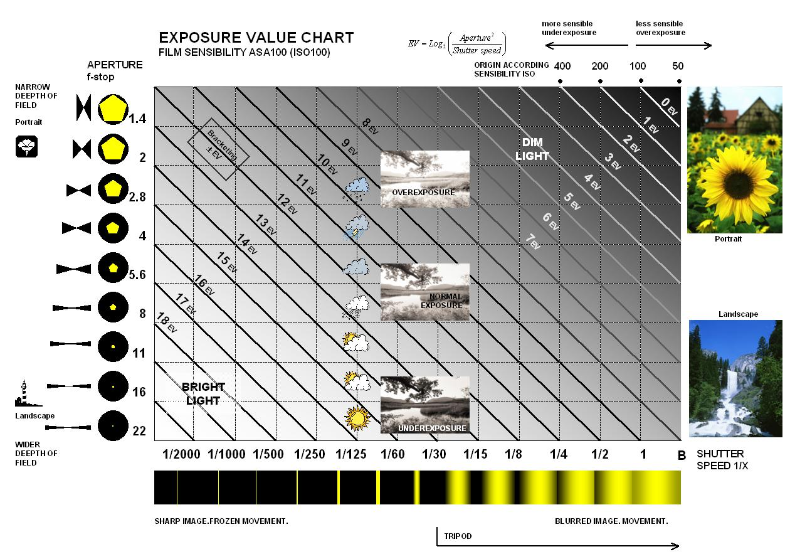
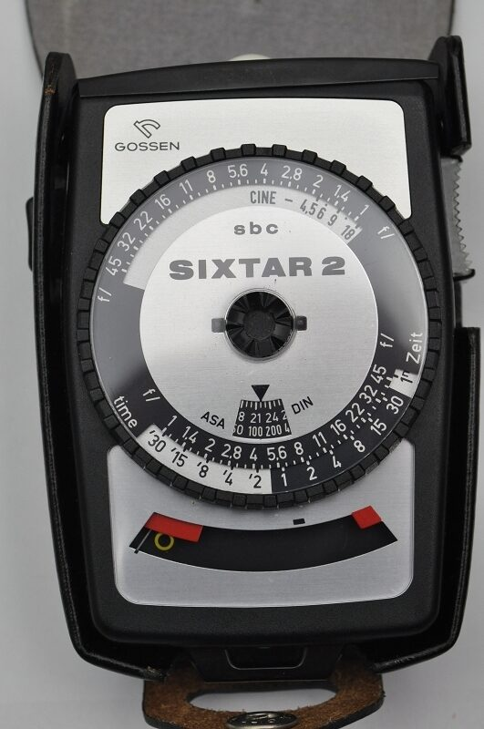
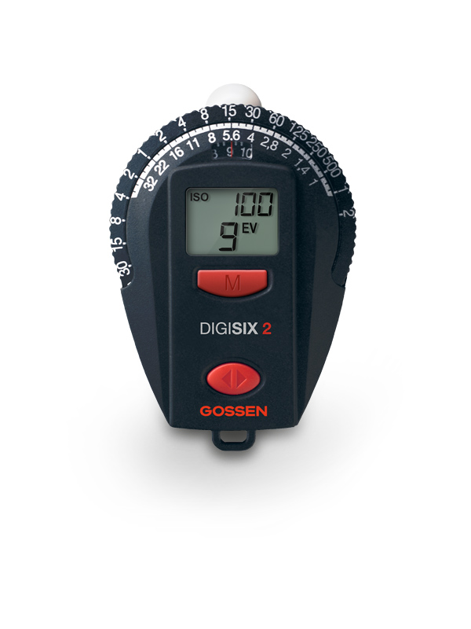
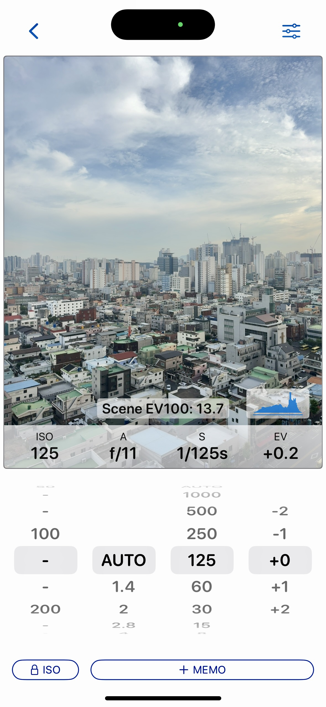
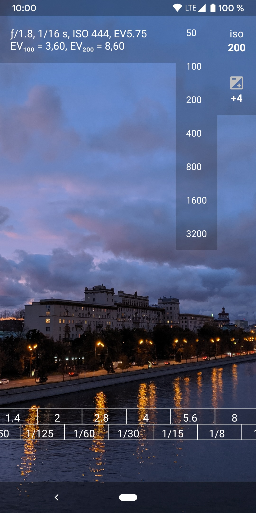

기타
===================================

Exposure value (EV)
---------------

그림을 추가했지만, 글로 설명하는 게 낫겠군요

.. note::
**간단하게, 1EV = 1스탑 입니다.**

노출 계수란건 카메라의 셔터 속도와 조리개 값의 조합을 나타내는 숫자입니다. EV 숫자가 높을수록 빛이 강하다는 걸 의미합니다.

노출계의 변천
--------------------
현재 사용되는 광전자식 노출계는 3가지 부류가 있습니다. 폰 카메라 센서를 사용하는게 있지만, 노출계 단독으로 굴리는걸 이야기 할려고 합니다.

#. 셀레늄 태양전지 혹은 실리콘 태양전지
#. 황화카드뮴(CdS)을 사용한 포토 레지스터
#. 실리콘 블루 셀(SBC), 혹은 포토다이오드

처음엔 셀레늄으로 만든 태양전지를 사용하여 노출계를 만들었습니다. 당연히 태양전지인 자체적으로 전기를 생산해서 전지가 필요없었습니다. 문제는 셀레늄 태양전지는 지금 기술로 만들어도 25년의 수명값을 가지고 만듭니다. 그러니까 지금 셀레늄 태양전지는 거진 수명이 다했다는 겁니다. 당시 사용된 셀레늄 노출계는 수광부가 잠자리 눈 같거나 혹은 빛을 가리는 특성이 있었습니다.

그 후에 황화카드뮴(CdS, Cadmium Sulfide)으로 만든 포토 레지스터가 등장합니다. 현재도 물감(카드뮴 옐로 등)등의 재료로 쓰이는 황화카드뮴은 빛을 받으면 저항이 줄어드는 특성을 가지고 있습니다. 건전지를 이때부터 넣기 시작했으며, 노출계의 소형화도 진행되었죠.

현재 사용중인 실리콘 블루 셀, 혹은 실리콘은 포토다이오드라 불리는 갈륨비소(GaAs) 기반의 실리콘입니다. 이건 셀레늄 태양전지가 아니라, 그 특성을 가져왔다고 볼 수 있겠네요. 당연히 황화카드뮴보다 더 작아졌고, 더 빠르면서 정확하게 노출을 쟀습니다. 여기부턴 '노출계'가 사치품 혹은 스튜디오의 부가 액세서리가 되었다고 볼 수 있죠.

아날로그 노출계 보는 법
~~~~~~~~~~~~~~~~~~~~~~~~~
여기선 디지털이 아닌 아날로그 노출계를 보는 방법을 설명하는게 나을거 같군요. CdS 노출계도 있고, 포토 다이오드 노출계도 있습니다. 일단 지금도 사용하니 말이죠.

사진 속 기종은 독일 Gossen 사의 SBC, 그러니까 포토 다이오드를 사용한 Sixtar 2 SBC 모델입니다. 다른것보다 이게 더 설명하기 쉬운거 같아서 들고옵니다.

#. ASA/DIN은 필름 감도를 의미합니다. 중간축을 돌려서 필름 감도를 설정합니다. 몇몇 구소련제 노출계의 경우엔 GOST란게 적혀있을 수도 있습니다. 여기서 GOST는 소련/러시아 표준인데, 대충 ASA랑 비슷합니다. DIN은 독일표준, ASA는 미국 표준이죠. ISO는 ASA 값으로 설정되어 있습니다.
#. 오른쪽 버튼을 눌러 눈금을 움직이게 하고, 눈금이 안정적일때 겉 바퀴를 돌려 노란 원이 눈금의 정 가운데로 오게 맞춥니다. 밤같은 어두운 곳을 재기 위해서 오른쪽에 스위치가 있습니다.
#. 측정한 적정 값을 읽어줍니다. 조리개 값인 f값은 고정되어 있고, 셔터스피드가 움직입니다. 1 다음에 ` 표시가 없는것은 초 단위 입니다. 그러니까, f/2 에선 1/8을 놓으면 되죠
#. 전 Sonnar f/1.5 렌즈를 가지고 있습니다. 그런데 여기엔 f/1.4밖에 없어서 어떻게 재나요? 하면 적절하게 한 눈금 정도 해석하면 됩니다. 이 사진에서 보자면 1/15 정도에 두고 찍으면 되겠군요.

이와 비슷한 방식이 Gossen Digisix죠. 크기도 작고, 리튬전지 먹고 기능도 많고...

사진은 Digisix의 개량판이라 일컫는 Digisix 2 입니다. 이건 포토다이오드를 사용하지만, 방법은 위와 같습니다.

#. 직사/반사형에 따라 덮개를 벗긴후 M 버튼을 누릅니다.
#. M 버튼을 누르면 EV값이 나옵니다.
#. 이 EV값에 맞춰서 윗 창을 보면서 맞는 EV값으로 돌려줍니다. 점이 하나, 둘 나올겁니다. 이것도 표식이 있기에 그대로 해줍니다.
#. 다 맞춘후 위에 설명한 것처럼 보시면 됩니다.

폰 노출계
~~~~~~~~~~
여기서 다루는 노출계는 매우 많습니다. 일단 제가 써본것중에서 괜찮다고 생각하는 것만 올립니다.

iOS
^^^^^
iOS 에선 여러앱이 있습니다. 전 `Light Lamb <https://apps.apple.com/kr/app/light-lamb/id1580207650>`_ 이나 혹은 한국분(DC인사이드 필름카메라 갤분)이 만든 `해빛 <https://apps.apple.com/kr/app/%ED%95%B4%EB%B9%9B/id6474086258>`_ 을 추천합니다. 

이건 Light Lamb의 화면이네요.

유료로 다른 곳에서도 호평받는것은 `myLightmeter Pro <https://photo-technic-tmi.readthedocs.io/ko/latest/필름.html#id3>`_ 가 있네요. 가격도 저렴하고, 여러 셋팅과 더불어 직사 / 반사를 정할수도 있죠.

안드로이드
^^^^^^^^^^^
안드에서는 `Exposure <https://play.google.com/store/apps/details?id=ru.chetverikov.exposure>`_ 란 앱을 추천합니다.

이건 Exposure 앱스토어 페이지에서 가지고 왔습니다. 카메라로 들어오는 빛에 따라 값이 변하며, 아래 노출바를 움직여서 적정 노출값을 찾을수 있습니다.

아우라 이야기, 사실성과 복제
-----------------------------
아우라란 개념을 만든 발터 벤야민은 근대 기술이 어떻게 인간에게 자유를 줄 수 있을까에 대한 고민을 하게 됩니다.

Walter Benjamin, "Das Kunstwerk im Zeitalter seiner technischen Reproduzierbarkeit" 혹은 발터 벤야민의 '기술복제시대의 예술작품'은 일종의 문화 평론 에세이입니다. 지금에 와서는 예술사회학, 미학등에의 주요 학술 참고문서중 하나죠.

벤야민은 원작의 여기와 지금이 진품성의 개념을 결정한다고 봤습니다. 그리고 진품성의 영역은 복제가능성에서 벗어난다고 할수 있구요. 그는 이걸 **아우라(Aura)** 라고 봤습니다. 그리고 이런 아우라는 복제에 의해서 감소하게 된다고 봤죠

벤야민은 왜 아우라의 붕괴가 일어나는가 봤더니, 하나는 사물을 공간적으로나 인간적으로 "더 가까이 가져오는 것"이 현대 대중의 충분하게 열정적인 갈망으로 인해, 그리고 두번째는 복제의 수용을 통해 모든 소재의 일회성을 극복하려는 경향이라 봤습니다.

그러면서 벤야민은 '진정한' 예술작품의 독특한 가치, 즉 아우라는 예술작품의 본래적인 최초의 사용가치를 가졌던 제의(Ritual, 특정 신앙, 신조, 종교에 따라 일정한 형식 규칙에 따라 사람이 하는 일상 생활에서의 활동과는 다른 특별한 행위)에 기초를 두고 있다고 봤고, 복제는 제의적 가치가 가졌던 절대적 무게를 예술에서 벗겨내게 해줬다고 봤습니다.

정리하자면, 발터 벤야민은 아우라의 몰락이 예술작품이 가지고 있는 권위를 몰락시켰고, 이러한 인식은 사회 전반으로 번져나가 결국 사회 속에서의 '성역'이라고 하는 의식을 무너트렸다고 보았습니다.

이온화 방사선 이야기
---------------------
18세기 경 프랑스에 앙리 베크렐이라는 물리학자가 있었죠. 옆 독일에서 X선을 발견했다고 하자, 이를 연구하다 서랍안에 넣어둔 사진 건판을 현상하게 되었습니다. 그 사진 건판은 빛을 보지도 않았는데 선명한 점이 하나 노출이 되어 있었고, 서랍안엔 피치블렌드가 들어있었더라고 합니다. 이를 연구하다 보니 방사능(Radioactive)을 발견하게 되었죠.

처음부터 필름으로 찾은터라, 지금도 빛을 보지 않도록 만든 필름 뱃지를 이용하여 사람이 얼마나 방사선을 받았는지 측정하는 선량계(Dosimeter)를 지금도 원자력 발전소 등의 시설에서 사용합니다.

이런 일이 벌어지는 이유는 우리가 아는 방사선(알파선, 베타선, X선, 감마선, 중성자선)은 물질을 이온화 시킬수 있다고 해서 이온화 방사선이라고 합니다. 간단하게 에너지(eV, 전자 볼트란 뜻으로, 1 eV는 1볼트와 같습니다. 비교하자면 가시광선은 평균 3.23 eV 인데, CT는 40~70 KeV 를 찍습니다)가 높아서 깽판치는 걸로 보시면 됩니다. 사진으로 찍는 가시광선은 에너지가 낮아서 이온화를 시키지 않아요. 전파도 마찬가지구요.

그래서 방사선 문제는 필름뿐 아니라, 디지털도 마찬가지입니다. 필름에 어떤 영향이 가는지 보실려면, `여길 <https://photo-technic-tmi.readthedocs.io/%ED%95%84%EB%A6%84.html#id3>`_ 보시면 됩니다.

자이스, 광학의 만능
---------------------------
독일 바덴뷔르템베르크 주 아래의 작은 도시 오버코헨과 작센 주 예나(Jena)엔 자이스 재단(Carl Zeiss Stiftung)이 위치해 있습니다. 물리학 분야중 광학이란 분야에서 자이스가 없다면 광학이 존재할까? 란 의문을 들게 만드는 회사기도 합니다.

자이스란 회사가 없으면 광학이란 분야가 날아갈 정도로 지분이 매우 큰 회사입니다. 조선시절인 1846년 카를 차이스가 회사를 세우고, 더 발전한 현미경을 만들기 위해 예나 대학교의 **에른스트 아베(Erent Abbe)** 교수를 데려옵니다. 그렇게 아베는 수학적으로 계산을 하여 광학 이론들을 정립해 갔습니다. 아베가 만든 것중 하나는 '아베 수' 라는 건데, 유리 안경렌즈가 일반 플라스틱 안경렌즈보다 왜 좋은지를 설명하는 수식입니다.

에른스트 아베는 차이스와 그리고 나중에 들어온 오토 쇼츠(Otto Schott)와 같이 일했습니다. 그러다 차이스가 사망하고, 아베는 자이스 재단을 만들고, 오토 쇼츠와 자신, 그리고 차이스의 주식을 재단에 넘겼습니다. 그렇게 현 정관에 따르면, 자이스와 쇼츠(자이스의 유리를 제공하며, 인덕션 유리 같은 특수 유리를 만들어 파는 회사입니다)의 주인은 재단만 가능합니다.

이렇게 아베는 재단에 주식을 다 던져 이익의 대부분이 연구에 돌아갈수 있게 했고, 자이스는 여러 발명을 하게 됩니다. 양안식 거리 측정기라던가, 전설적인 **테사(Tessar)** 렌즈같은거 말이죠. 구 자이스 로고가 테사 유리 블록중 아랫 부분을 가져와서 만든겁니다.

자이스는 1차 세계대전에서도 두각을 보였지만(전쟁 도중, 영국과 독일제국간 고무와 자이스제 광학장비를 바꾸는 그런 딜도 있었습니다), 2차 세계대전에서도 미친 존재감을 드러냈습니다. 나치의 선전무대였던 뮌헨 올림픽에서는 당시 세계에서 제일 좋은 카메라와 렌즈인 Contax II + Sonnar f/1,5 를 내놨고, 지금 사용되는 광학장비엔 기본으로 들어가는 렌즈 코팅 기술도 자이스가 처음으로 만들었습니다.

2차 세계대전이 끝나고 자이스는 2개로 나눠지게 됩니다. 서로 아베의 적자로 우기면서 법적 분쟁도 많이 발생했습니다. 이후 냉전이 끝나고, 두 회사는 아베의 자식이란 것에 동의하여 합병을 하게 됩니다. 합병은 매우 힘든 과정이었지만, 둘의 '아베에 대한 의지'가 모든걸 해냈죠.