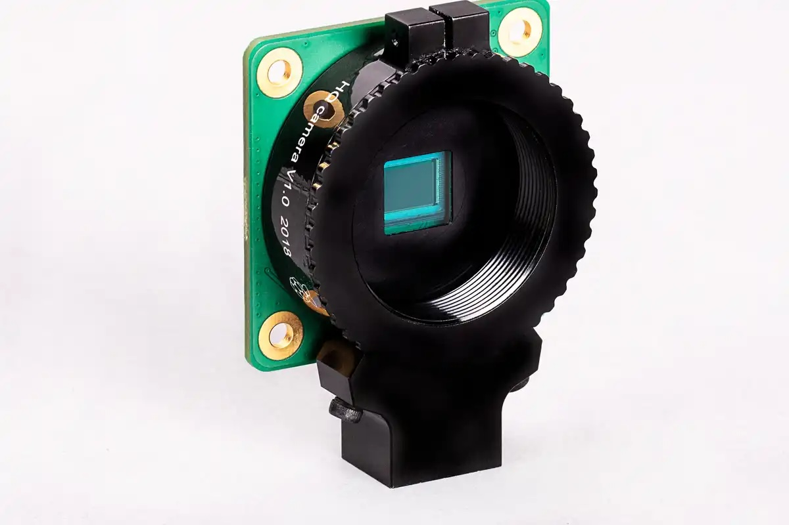

디지털
===================================

디지털은 어떻게 사진을 기록하나요?
-----------------------------------
필름은 화학반응이지만, 디지털은 전자식 반응입니다. 보통 CCD(Charge Coupled Device, 전하결합소자), CMOS(Complementary Metal Oxide Semiconductor, 상보형 금속 산화 반도체)를 센서로 사용하죠.

필름은 모든 걸 다 필름이 처리하지만, 디지털의 경우 센서가 모든 걸 다 떠맡지는 않습니다.

센서 안에서 모든 걸 하지 않는다는 건, 이 센서에서 전원을 인가하여 받은 광 정보 데이터를 컴퓨터로 보내고, 이를 컴퓨터 안에서 조절한 결과물(보통은 디지털 이미지 처리 프로세서)을 최종 사용자에게 제공합니다. 이 과정에서 계산(노이즈 제거 등)들이 선행될 수 있습니다.

사진은 라즈베리 파이에서 만들어서 파는 12.3 MP 센서(겸 C 마운트를 연결할 수 있는 카메라 모듈)입니다. 센서에서 데이터를 받은 파이는 CPU에서 카메라 소프트웨어를 사용하여 그림을 처리하여 사용자에게 보여주죠. 모듈이라구요? 실제 카메라 만들어서 돌아다니는 분도 있습니다. 이것도 충분히 카메라지요.

RAW 파일은 위에서 말한 계산을 안 거친, 센서에서 나온 수정하지 않은 날것의 이미지입니다. 그래서 이걸 둘 다 뱉는 폰카 앱의 경우, 색감이 이상한 걸 볼 수 있기도 합니다.

눈, 강력하지만 헛똑똑이 디카
----------------------------
눈도 디지털카메라라고 볼 수 있죠.

.. image:: images/eye_spectrum.jpg
 :width: 600

위 그림은 우리 눈의 원추 세포 3개가 신호를 보내는 영역으로, 제일 높은 건 그 파장을 잘 받아들인다는 거죠. 이렇게 흡수한 빛을 전기 신호로 바꿔서 시신경을 통해 뇌 뒤통수로 보냅니다.

위에 적은 디지털카메라처럼 눈도 렌즈(수정체)를 거쳐서 들어온 센서(망막)에서 보낸 데이터를 뇌에서 90% 정도 자르는 것으로 알려져 있습니다. 우리가 보는 것들은 이미 뇌에서 이미지 처리가 된 것들이죠.

눈 스펙을 뒤져보실 분이 계실거같은데, 들고 있는 폰카보다 더 못한 경우도 있습니다. 그렇지만 평생 가지고 있어야 하니 중요한 물건이죠.

디지털에서의 ISO
----------------------------
필름의 ISO는 `할로젠화 은 결정 크기 <hhttps://photo-technic-tmi.readthedocs.io/ko/latest/%ED%95%84%EB%A6%84.html#iso>`_ 라고 했습니다. 그러면, 디지털에서의 ISO는 뭘까요?

ISO에 의하면 광전효과에 의한 관전 변환함수(OECF)를 이용합니다. 여기서 광전효과는 금속 등의 물질이 한계 진동수(문턱 진동수)보다 큰 진동수를 가진 (따라서 높은 에너지를 가진) 전자기파를 흡수했을 때 전자를 내보내는 현상이라 하는데, 그냥 금속 같은 게 빛 받으면 전자를 뱉는다고 알고 계시면 됩니다. 이걸로 아인슈타인이 노벨상을 탔죠.

이미 필름에 대한 ISO 표준이 만들어져 있기 때문에, 이 광전효과에 대한 필름과 비슷하게 올라갈 것이고, 그래서 필름에선 생각할 수 없는 만 단위 이상까지 올라갈 수 있는것이죠. 센서에 빛이 닿아서 전자가 흐르게 되면 이걸 쳐야되니까 말이죠.

그래서 ISO 조정이 쉽다고 볼 수 있겠습니다. 필름은 할로젠 은 결정에서 비롯되지만, 디지털은 디지털 센서의 프로세서가 이를 결정하니 말이죠.

픽셀은 무조건 많아야 좋죠? 그렇다고 해주세요
---------------------------------------------
글...쎄요. 일단 픽셀이 많은 것은 좋은 광고가 됩니다. 근데, 이 픽셀이 무지막지하게 많다고 해도 카메라가 더 좋아지는 건 아니며, 부정적인 영향을 끼칠 수도 있어요. 물론, 크롭, 즉 작은 부분을 확대하여 돋보이게 하는 경우엔 좋지만 일반적인 경우엔 노이즈 문제 등으로 같다는 의견이 많습니다.

.. image:: images/KissOfLiberation.jpg
 :width: 600

오히려 사진을 찍는 사람이 중요하죠. 예를 들어 라이카를 들고 있어도 전설적인 앙리 카르티에 브레송이 되는 것도 아니고, 10 MP 정도의 낮은 카메라로 찍어도 사진과 같은 사진을 남길 수 있습니다. 

이 비유가 맞아떨어지네요. 당시엔 Contax II 와 라이카가 서로 자리를 두고 싸웠습니다. Contax II 쪽은 저널리스트, 라이카 쪽은 예술쪽이었죠. 근데 정작, 이 사진은 당시 미국에서 싸게 풀려 대중적인 카메라 Argus C3이었습니다. 노르망디 상륙작전부터 정찰병으로 Argus C3을 매고 사진을 찍은 Tony Vaccaro 분이 1944년 프랑스 한 마을을 연합군이 들어와서 해방하면서 찍은 사진입니다.

누구나 말하듯이 도구가 모든 걸 다 말하지 않죠. 여기 처음에 적은 것처럼 파리 잡는데 스털링 실버 판을 쓰는 것과 같이 말이죠.

라이카는 무조건 MF죠?
-----------------------------------
L39, M 시리즈 모두 수동 렌즈입니다. 필름도 같습니다. 예전에 교세라에서 만들었던 Con tax - 자이스 카메라 브랜드로 디카도 만들었지만 철수했습니다 - G 시리즈에선 이런 레인지파인더 카메라 최초로 AF를 도입했지만, 현재까지는 새 규격 등을 뱉거나 혹은 AF로 위치도 정해줄 생각도 없어 보이네요.

이거 말고도, 프랑스에서 개발한 `Pixii <https://www.pixii.fr>`_ 이란 디지털 레인지파인더 카메라나, 매우 유명한(지금은 단종되어 부품 찾을려면... 아이고) 엡손 R-D1도 이 렌즈 시스템을 사용하기에 같습니다.

물론, TECHART PRO LM-EA7처럼 이종 변환에서 사용할 수 있도록 도와주는 변환기(라이카 M 마운트에서 소니 E 마운트)가 존재하다고 합니다. 사용은 여러분 선택이죠.

디지털백 이란 것이 있지 않나요?
-----------------------------------------
중형에선 디지털백이란게 있습니다. 필름을 끼웠던 필름 백 대신 센서를 넣은 디지털 백을 꽂는것이죠. 그로 인해 쉽게 교체가 가능합니다.

하여튼 그렇게 쉬웠다면 문제는 더 쉬웠겠지요

35mm의 경우, 아예 `뜯기 <https://www.reddit.com/r/3Dprinting/comments/14ch2fv/i_really_wanted_a_digital_rangefinder_so_i_spent/#lightbox>`_ 혹은 밑에 대롱대롱 줄을 매달아서 만든 `제품 <https://imback.EU/home/>`_ 등등이 있습니다. 혹자는 라즈베리 파이(네 저 위의 녀석과 연결하는 컴퓨터)와 센서를 연결 시키는 방식들이 있습니다.

여기서 한가지 이야기를 해볼까 합니다. 일명 납치당해서 노예로 산다는 대학원(그냥 여긴 중세 길드제와 같죠)에서 하는 '논문을 안 적은 이유'란 이야기가 있는데, 다음 2가지를 꼽습니다.

#. 다른 사람들이 생각을 못해 안 적음
#. 논문을 쓰기엔 매우 어려움

35mm는 2개 + 감성맛이라고 볼 수 있겠죠. 사람들이 필름 멋에서 떨어지지 못하고 등등... 방법은 필름 스캔본을 가져다가 잘 노는 것밖에 없을거같군요. 누구 말대로 포기하면 편할지도 모르죠.

iOS 한정 내돈 주고 내가 쓴 Halide
-----------------------------------------
지금은 제가 안드로이드를 쓰지만, iOS를 한국에 처음 발매한 3Gs부터 썼었고, 구독안하고 한 번에 지불하여(8 만원 합니다.) 지금도 매우 만족하는 프로그램이 있습니다. 사진을 찍는 Halide입니다. 솔직히 이것만 해도 iOS 다른 사진 앱은 제끼는 거 같다고 생각 하네요

디지털에서 폰카를 운운하는건 어떯게 보면 이상하겠지만, 이 앱으로 인해서 쉽게 ProRAW(애플에서 만든 RAW 파일)이라던가 RAW 파일을 쉽게 만들 수 있고, 전문적인 사진(MF는 아니지만서도)을 찍을 수 있다는 게 매우 좋은거죠. 안드로이드는 제가 앱을 제대로 안써서 모르겠습니다. 쓴 기간도 적기도 하고 말이죠...

.. image:: images/halide 1. jpg
 :width: 500
Halide은 매우 직관적으로 되어 있고, 찍으면 정보 같은게 기본 카메라 앱보다 더 자세하게 나오죠…. 제가 찍은 폰카 사진 대다수는 이 Halide로 찍은 사진들 입니다.

.. image:: images/halide 2. jpg
 :width: 500
애플에선 디자인 상이라고 애플 앱 중 상을 수여하는데, 이 상에서 수상을 한 프로그램 중 하나죠. Wavefoam 옆의 네모는 인물 사진 모드입니다.

프로세스 제로
>>>>>>>>>>>>>>>>>>>>>
일단 iOS는 갇힌 곳입니다. 안드로이드처럼 맘대로 자유롭게 할 수 없고, OS - API - 앱 이런 구조로 갖춰진 공간이에요. 그래서 타 앱의 기능을 불러오려면 API란 가교를 써야 하죠.

하여튼, 프로세스 제로는 이 iOS의 계산 기능을 젖힌 것입니다. 물론, RAW 파일 나옵니다. 전 필름을 찍다 보니 프로세스 제로가 더 인상적이었습니다.

.. image:: images/process zero 1. jpg
 :width: 500
이건 iOS 이미지 처리 프로세스가 개입된 사진입니다.

.. image:: images/process zero 2. jpg
 :width: 500
이건 iOS 이미지 처리 프로세스를 건너뛴 사진입니다. 프로세스 제로에선 하나의 렌즈를 활용하여 필름처럼 찍을 수 있죠.