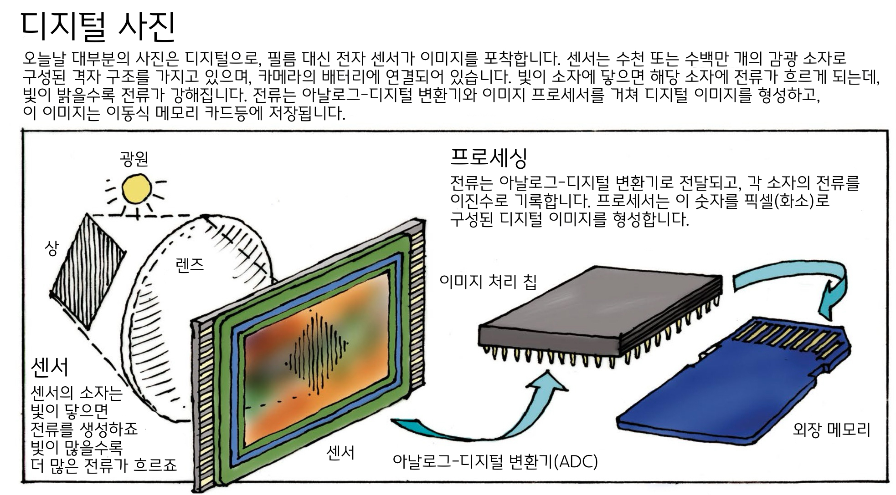
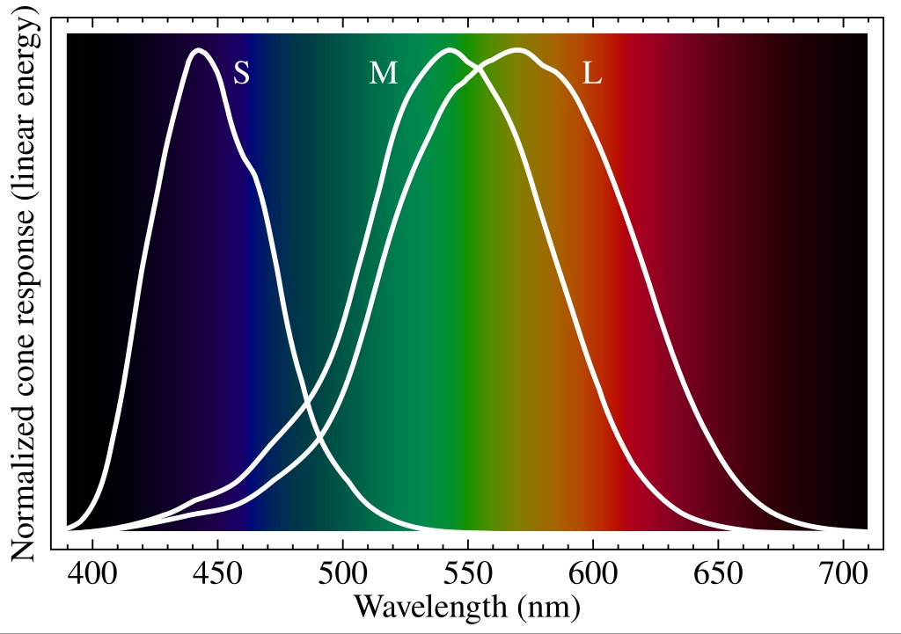
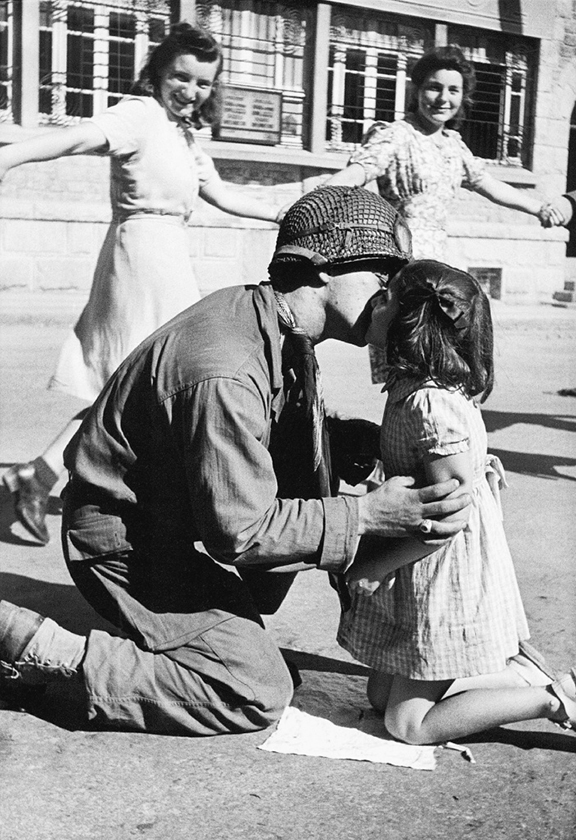

디지털
===================================

디지털은 어떻게 사진을 기록하나요?
-----------------------------------
필름은 화학반응이지만, 디지털은 전자식 반응입니다. 보통 CCD(Charge Coupled Device, 전하결합소자), CMOS(Complementary Metal Oxide Semiconductor, 상보형 금속 산화 반도체)를 센서로 사용하죠.

필름은 모든 걸 다 필름이 처리하지만, 디지털의 경우 센서가 모든 걸 다 떠맡지는 않습니다.

센서 안에서 모든 걸 하지 않는다는 건, 이 센서에서 전원을 인가하여 받은 광 정보 데이터를 컴퓨터 칩으로 보내고, 이를 컴퓨터 안에서 조절한 결과물(보통은 디지털 이미지 처리 프로세서)을 최종 사용자에게 제공합니다. 이 과정에서 계산(노이즈 제거 등)들이 선행될 수 있습니다.

설명이 너무 복잡한거 같아서 쉽게 눈으로 파악할수 있는 일러스트를 들고 왔습니다. 대한민국에선 도구와 기계의 원리 Now로 번역되었죠. 네, 매머드 나오는 그 책 맞아요. 여튼 폰카건, 비싼 DSLR이나 미러리스든 간에 이 구조를 따릅니다. 덤으로 이 센서를 확대한 것도 있지만 여기선 대략적으로 볼려고 이것만 들고왔죠.

RAW 파일은 아날로그-디지털 변환기만 거친 파일입니다. 그래서 이걸 둘 다 뱉는 폰카 앱의 경우, 색감이 이상한 걸 볼 수 있기도 합니다.

디지털은 CCD나 CMOS 같은 반도체를 사용하기 때문에, 이런 특성으로 인해 적절한 방호를 안해두면 필름보다 더 방사선에 취약하기도 합니다. 자세한건 `여기 <https://photo-technic-tmi.readthedocs.io/ko/latest/기타.html#id4>`_ 에서 보세요.

눈, 강력하지만 헛똑똑이 디카
----------------------------
눈도 디지털 카메라라고 볼 수 있죠.

위 그림은 우리 눈의 원추 세포 3개가 신호를 보내는 영역으로, 제일 높은 건 그 파장을 잘 받아들인다는 거죠. 이렇게 흡수한 빛을 전기 신호로 바꿔서 시신경을 통해 뇌 뒤통수로 보냅니다. 뒷통수를 맞으면 별이 보이는게 이것 때문이죠.

위에 적은 디지털 카메라처럼 눈도 렌즈(수정체)를 거쳐서 들어온 센서(망막)에서 보낸 데이터를 뇌(이미지 처리 칩등등)에서 90% 정도 자르는 것으로 알려져 있습니다. 우리가 보는 것들은 이미 뇌에서 이미지 처리가 된 것들이죠. 이 잘린 이미지는 맹점(망막에서 나온 신경다발이 지나가는 곳. 간단하게 센서역할하는 세포가 없는 곳)과 같은 것들이 포함되어 있습니다.

눈 스펙을 뒤져보실 분이 계실거같은데, 들고 있는 폰카보다 더 못한 경우도 있습니다. 그렇지만 평생 가지고 있어야 하니 중요한 물건이죠.

사람 눈의 스펙
~~~~~~~~~~~~~~~~
사람 눈 스펙을 카메라에 맞게 적어보자면 다음과 같습니다. `한 사이트 의 설명 <https://www.bhphotovideo.com/c/find/newsLetter/The-Photographic-Eye.jsp>`_ 이고, 이 값은 아래 적은것과 같이 매우 변동적입니다.

#. 특정 시점에서 실제로 초점을 맞추는 이미지 영역의 크기는 전체 장면의 약 0.5°에 불과. 나머지 이미지는 흐릿하며 시야의 모서리로 갈수록 점점 흐릿하며, 이 이미지들은 안구 운동으로 보완함.
#. 두 눈을 통해 뇌가 해석하는 인간의 시각은 약 120~140°
#. 실제 초점거리 - 22.3mm. 17mm 혹은 16.7mm 가 눈의 초점거리라 주장하는 경우, 눈 안쪽에서 바깥쪽으로 투사된 이미지를 기반으로 함
#. 해상도 - 참 머리아픈 질문. 흔히 언급되는 숫자 중 하나는 576MP인데, 이는 90° 화각의 장면을 기준으로 하며 풀프레임 35mm 카메라의 24mm 렌즈가 촬영하는 것과 유사. 한 온라인 추정에 따르면, 74MP 이미지 파일은 약 20인치 거리에서 볼 때 일반 사람의 눈이 고품질 사진 인쇄물에서 구분할 수 있는 최대 디테일을 표현
#. ISO - 해상도와 함께 골아픈 질문. 저조도 환경에서는 약 ISO 800을 가짐. 또한 일반적인 눈이 더 밝은 조명 조건에서 감지할수 있는 명암비는 10,000:1 으로 필름이나 디지털을 능가함
#. f 값 - 보통 f/2.4 정도이며, f/2.1에서 f/3.8 사이로 추정. 물론 이것도 머리아픈 수치 - 나이 또는 건강, 컨디션에 영향. 눈밭에서 뛰어놀거나 해변에서 놀때 최소 조리개 값은 f/8.3 ~ f/11 이며, 이 경우도 여러 변수에 따라 달라짐
#. 셔터스피드 - 여튼 1/100 만큼 짧은 빛도 쉽게 감지하며, 통제된 환경에서는 1/200보다 짧은 빛도 감지

디지털에서의 ISO
----------------------------
필름의 ISO는 `할로젠화 은 결정 크기 <https://photo-technic-tmi.readthedocs.io/ko/latest/%ED%95%84%EB%A6%84.html#iso>`_ 라고 했습니다. 그러면, 디지털에서의 ISO는 뭘까요?

국제 표준화 기구의 디지털에서의 표준에 의하면 광전효과에 의한 광전 변환함수(OECF)를 이용합니다. 여기서 광전효과는 금속 등의 물질이 한계 진동수(문턱 진동수)보다 큰 진동수를 가진 (따라서 높은 에너지를 가진) 전자기파를 흡수했을 때 전자를 내보내는 현상이라 하는데, 그냥 금속 같은 게 빛 받으면 전자를 뱉는다고 알고 계시면 됩니다. 이걸로 아인슈타인이 노벨상을 탔죠.

이미 필름에 대한 ISO 표준이 만들어져 있기 때문에, 변환함수는 필름과 비슷하게 올라갈 것이고, 그래서 필름에선 생각할 수 없는 만 단위 이상까지 올라갈 수 있는것이죠. 센서에 빛이 닿아서 전자가 흐르게 되면 이걸 쳐야되니까 말이죠.

그래서 ISO 조정이 쉽다고 볼 수 있겠습니다. 필름은 할로젠 은 결정에서 비롯되지만, 디지털은 디지털 센서의 프로세서가 이를 결정하니 말이죠.

픽셀은 무조건 많아야 좋죠? 그렇다고 해주세요
---------------------------------------------
글...쎄요. 일단 픽셀이 많은 것은 좋은 광고가 됩니다. 근데, 이 픽셀이 무지막지하게 많다고 해도 카메라가 더 좋아지는 건 아니며, 부정적인 영향을 끼칠 수도 있어요. 물론, 크롭, 즉 작은 부분을 확대하여 돋보이게 하는 경우엔 좋지만 일반적인 경우엔 노이즈 문제 등으로 같다는 의견이 많습니다.

오히려 사진을 찍는 사람이 중요하죠. 예를 들어 라이카 바르낙을 들고 있어도 전설적인 앙리 카르티에 브레송이 되는 것도 아니고, 8MP 정도의 낮은 카메라로 찍어도 세기의 사진을 남길 수 있습니다.

이 이야기가 맞아 떨어지네요. 당시엔 칼 자이스의 Contax II 와 라이카가 누가 제일 잘났나 자리를 두고 싸웠습니다. Contax II 쪽은 저널리스트, 라이카 쪽은 예술쪽이었죠. 근데 정작, 이 사진은 당시 미국에서 매우 싸게 풀려 대중적인 카메라였던 Argus C3 - 여담이지만, 당시 해군 장교였고, 나중에 대통령까지 간 지미 카터도 이걸로 가족들과 사진 찍고 놀았습니다 - 으로 찍었습니다. 이 사진은 당시 정찰병으로 Argus C3을 들고 노르망디 상륙작전부터 사진을 찍은 Tony Vaccaro 분이 1944년 프랑스 한 마을을 연합군이 들어와 해방하면서 찍은 그 분의 대표작입니다.

누구나 말하듯이 도구가 모든 걸 다 말하지 않죠. 도구가 아니라 뭘 찍어야 할까를 생각해봐야 하지 않을까요?

라이카는 무조건 MF죠?
-----------------------------------
L39, M 시리즈 렌즈 모두 수동 렌즈입니다. 필름도 같습니다. 예전에 교세라에서 만들었던 Contax - 자이스 카메라 브랜드로 디카도 만들었지만 철수했습니다 - G 시리즈에선 이런 레인지파인더 카메라 최초로 AF를 도입했지만, 현재까지는 새 규격 등을 뱉거나 혹은 AF로 위치도 정해줄 생각도 없어 보이네요. 자이스도 Contax 브랜드를 더이상 내놓지 않고, ZM 렌즈를 만들어서 판매하고 있습니다.

이거 말고도, 프랑스에서 개발한 `Pixii <https://www.pixii.fr>`_ 란 디지털 레인지파인더 카메라나, 매우 유명한(지금은 단종되어 부품 찾을려면... 아이고) 엡손 R-D1도 이 렌즈 시스템을 사용하기에 같습니다.

물론, TECHART PRO LM-EA7처럼 이종 변환에서 비슷하게 사용할 수 있도록 도와주는 변환기(라이카 M 마운트에서 소니 E 마운트. 렌즈는 무한대이며, 컨버터가 돌아가는 형태)가 존재하다고 합니다. 사용은 여러분 선택이죠.

디지털백 이란 것이 있지 않나요?
-----------------------------------------
중형에서는 디지털백이란게 있습니다. 필름을 끼웠던 필름 백 대신 CMOS/CCD 센서를 박은 디지털 백을 꽂는것이죠. 그로 인해 쉽게 교체가 가능합니다.

하여튼 그렇게 쉬웠다면 문제는 더 쉬웠겠지요

35mm의 경우, 아예 `뜯기 <https://www.reddit.com/r/3Dprinting/comments/14ch2fv/i_really_wanted_a_digital_rangefinder_so_i_spent/#lightbox>`_ 혹은 밑에 대롱대롱 줄을 매달아서 만든 `제품 <https://imback.EU/home/>`_ 등이 있습니다. 혹자는 라즈베리 파이(네 저 위의 녀석과 연결하는 컴퓨터)와 센서를 연결 시키는 방식들이 있습니다.

여기서 한가지 이야기를 해볼까 합니다. 일명 납치당해서 노예로 산다는 대학원(그냥 여긴 중세 길드제와 같죠)에서 하는 '논문을 안 적은 이유'란 이야기가 있는데, 다음 2가지를 꼽습니다.

#. 다른 사람들이 생각을 못해 안 적음 = 누가 말하듯 개꿀찬스
#. 논문을 쓰기엔 매우 어려움

35mm는 2개 + 감성맛이라고 볼 수 있겠죠. 사람들이 필름 멋에서 떨어지지 못하고 등등... 방법은 필름 스캔본을 가져다가 잘 노는 것밖에 없을거같군요. 혹은 누구 말대로 포기하면 편할지도 모르죠.

iOS용 내돈 주고 쓴 Halide
-----------------------------------------
전 iOS를 한국에 처음 발매한 3Gs부터 썼습니다. 여럿 사진앱들을 봤는데, 구독안하고 한 번에 지불하여(현재 8 만원 합니다. 구독도 있습니다) 지금도 매우 만족하는 프로그램이 있는데, 사진을 찍는 Halide입니다. 솔직히 이것만 해도 iOS의 다른 사진 앱은 제끼는 거 같다고 생각하네요.

디지털에서 폰카를 운운하는건 어떯게 보면 이상하겠지만, 이 앱으로 인해서 ProRAW(애플에서 만든 RAW 파일)이라던가 RAW 파일을 쉽게 만들 수 있고, 전문적인 사진(MF도 가능하지만서도)을 찍을 수 있다는 게 매우 좋은거죠.

.. image:: images/halide 1. jpg
 :width: 500
 
Halide은 매우 직관적으로 되어 있고, 찍으면 정보 같은게 기본 카메라 앱보다 더 자세하게 나오죠…. 제가 찍은 폰카 사진 대다수는 이 Halide로 찍은 사진들 입니다.

.. image:: images/halide 2. jpg
 :width: 500

애플에선 애플 디자인 상이라고 애플 앱 중 상을 수여하는데, 이 상에서 수상을 한 앱 중 하나죠. Wavefoam 옆의 네모는 포트레이트 모드입니다.

프로세스 제로
>>>>>>>>>>>>>>>>>>>>>
일단 iOS/iPadOS는 애플이 의도적으로 만든 갇힌 OS입니다. 안드로이드처럼 맘대로 자유롭게 할 수 없고, AVFoundation(API이긴 한데, OS에 매우 깊숙하게 관여하고 있습니다) - 앱 이런 구조로 갖춰진 공간이에요. iOS/iPadOS 에선 타 기능에 접근하려면 API란 가교를 써야 하죠.

하여튼, 프로세스 제로는 이 iOS 카메라의 컴퓨테이션 기능을 꼼수로 젖힌 것입니다. 카메라가 2개 있다면, 카메라를 하나만 사용하는 식으로 말이죠. 이런 이유로 이에 관련된 RAW 파일도 제대로 나옵니다. 전 필름을 찍다 보니 프로세스 제로가 더 인상적이었습니다.

.. image:: images/process zero 1. jpg
 :width: 500
이건 iOS 이미지 처리 프로세스가 개입된 사진입니다.

.. image:: images/process zero 2. jpg
 :width: 500

이건 iOS 이미지 처리 프로세스를 건너뛴 사진입니다. 프로세스 제로에선 하나의 렌즈를 활용하여 필름처럼 찍을 수 있죠.

안드로이드용 OpenCamera
---------------------------
.. image:: images/opencamera. jpg
 :width: 500

안드로이드엔 구글 플레이 스토어 말고도 여럿 대체 스토어가 있습니다. 그중에서 사람들이 자발적으로 검수하여 악성코드가 없으며, `오픈소스 <https://photo-technic-tmi.readthedocs.io/ko/latest/저작권.html>`_ 로 풀려있는, F-Droid 란 곳이 있습니다. 여기 있는건 다 검증받고 올리는 것이지만, 구글에서 검증을 안한 프로그램들입니다.

이 앱도 마찬가지인데 `구글 플레이 스토어 <https://play.google.com/store/apps/details?id=net.sourceforge.opencamera&hl=ko>`_ 에서는 광고 API가 포함되어 있어서, 혹여나 구글 플레이 스토어에선 광고가 띄어질 수 있지만, 여기서 받으면 광고없이 이 프로그램을 이용하실 수 있습니다. 좋으시면 구글 플레이에서 광고 버전을 이용하시던가, 아님 개발자에게 기부를 해보시는건 어떠실까요?

완전한 오픈소스 버전은 `여기서 <https://f-droid.org/ko/packages/net.sourceforge.opencamera/>`_ F-Droid 스토어를 설치한후 설치하시면 됩니다.

일단 컴퓨테이션 쪽에선 빌트인 카메라를 따라가기 참 어렵지만, 여러가지 MF 옵션을 제공합니다. 프로세스 세팅에 들어가서 여러가지 설정을 바꿀수도 있고 말이죠. 영어로 되어있지만, 어느정도 읽어볼 수 있는 것이라서 추천드립니다.