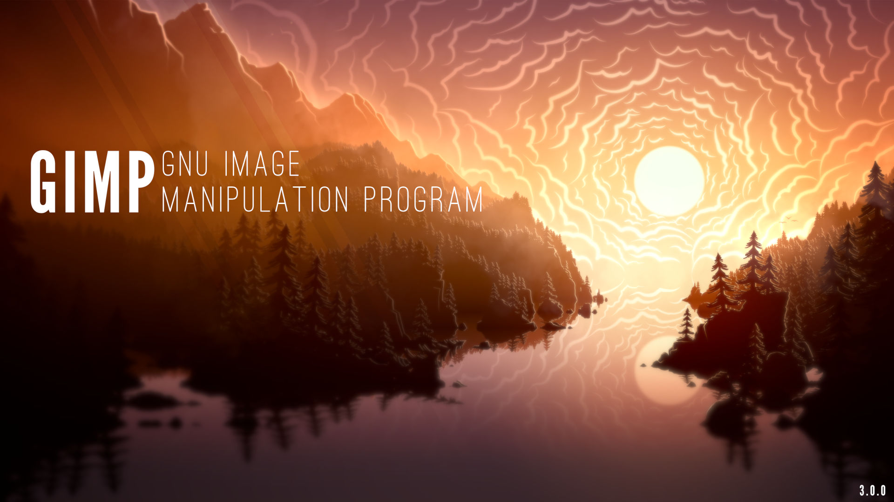
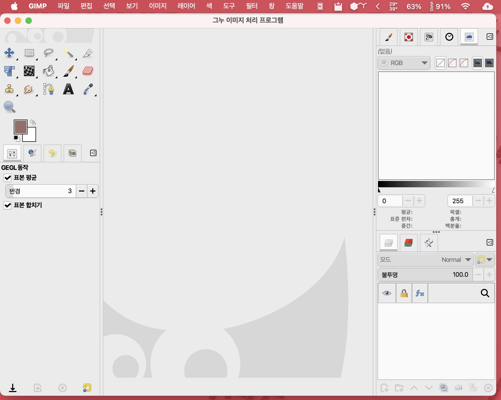
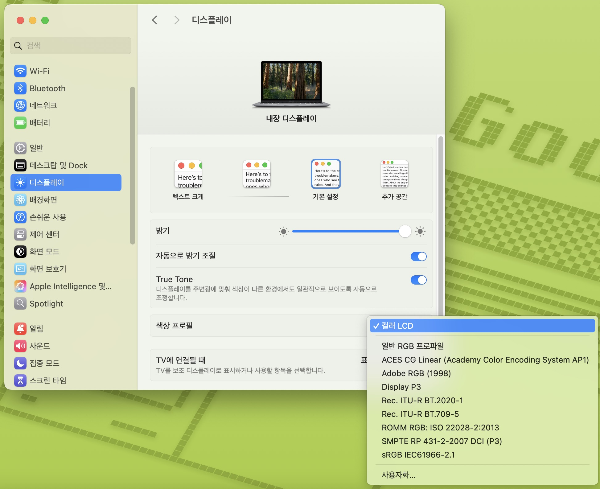
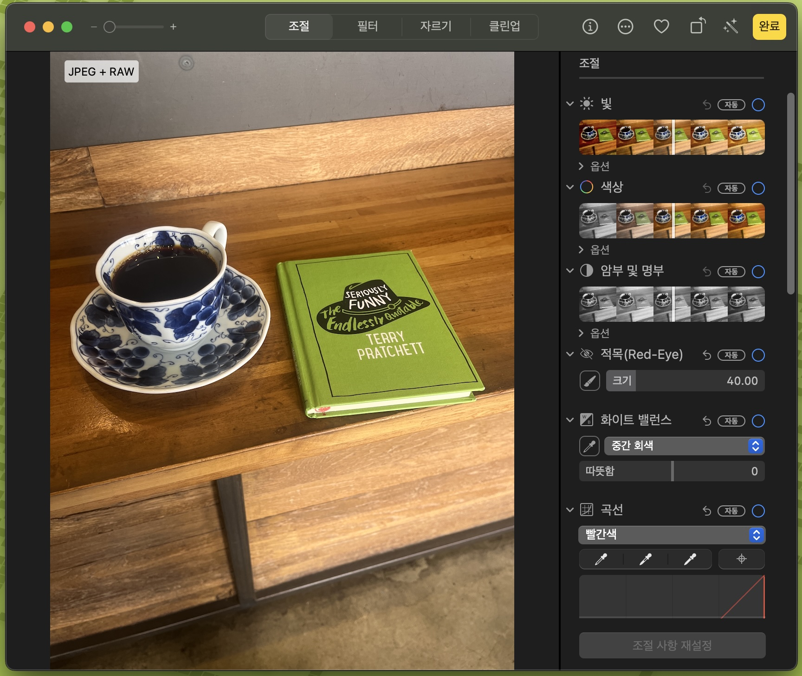

보정프로그램
===================================

**여기서는 왠만하면 돈주고 라이선스를 구매하는 것 보단 대체할 수 있는 무료를 이야기 합니다.**

GIMP
--------------

**GNU IMAGE MANIPULATION PROGRAM** - GNU 이미지 처리 프로그램이라고 불리는 오픈소스 계에서의 포토샵(레스터 이미지 생성, 사진 수정등등) 역할을 하는 프로그램입니다. 당연히, `Darktable <https://www.darktable.org/>`_ 이라고 하는 어도비 라이트룸과 비슷한 RAW 편집 프로그램이 있지만, GIMP의 경우 한글화가 좀 되어 있고 포토샵처럼 쓸수 있다는 것도 장점이군요. 이번 3.0부터는 필터를 적용하고 되돌릴수 없었던 문제를 해결한 비파괴 편집과 캔버스서 바로 미리보기가 가능하게 되었습니다.

GIMP는 여러 유명한 리눅스 배포판들이 설치될 때 딸려오는 프로그램이기도 하죠. 덤으로 오늘도 수많은 행정병들이 이걸 붙들고 머리를 싸매고 있기도 하죠. 스크린샷은 제 맥에서 찍은 스샷이네요.

무료로 가져다 쓰되, 규칙은 지켜라하는 오픈소스로 풀려있기에 다른 사람들이 개조할수도 있습니다. 예를 들어, 포토샵 단축키/레이아웃에 맞게 수정한 `PhotoGIMP <https://github.com/Diolinux/PhotoGIMP>`_ 란 놈도 존재하며, GMIC 같은 여러 플러그인을 추가할수도 있습니다.

중요한건 달마다 돈을 낼 필요가 없다는 것이고, 계속해서 활발하게 개발이 이뤄지고 있는 프로그램입니다. 리눅스 쪽에서 사진편집을 하고 싶다! 라고 하시는 분들이 많이 애용하고 있고, Youtube에는 GIMP를 사용하는 강좌들도 많이 있습니다. 2019년엔 한국에 책도 나왔군요. 근데 버전이 많이 차이가 나서 참고용으로는 좋을거 같습니다 네...

GIMP는 `GIMP 공식 사이트 <https://www.gimp.org>`_ 에 들어가셔서 현재 최신버전을 다운로드 받으실 수 있습니다.

맥, 사진앱
--------------

보통 사진용으로 맥을 사시는 분들이 많습니다. 맥이 원래 이런 예술 쪽에서 먹고 살아서 그렇거든요. 물론 뽀대 - 예전엔 스타벅스 입장권이라 불렸죠 - 를 위해 사시는 분이 있지만, 대부분 망했습니다. 여튼 포토샵, 어피니티 등이 다 지원하고, 이걸로 현재 밥을 드시는 분이 계시니 더이상 할 말이 없습니다. 네...

윗 그림은 맥 화면에 맞출수 있는 컬러 프로파일입니다. 기본적으로 몇개를 지원해주는데, 안되면 프로파일을 추가하여 인쇄 프로필에 맞게 추가할수 있습니다. 이걸로 뽑을수 있는 것에 더 충실한 자료가 나올수 있죠. 윈도도 당연히 있습니다만, 맥이 대놓고 저지르고 있죠.

여기서 말핧건 기본 사진앱입니다.

사실 사진 앱은 이런 모습이 아니었습니다. 원래는 더 강력한 Aperature란 프로용 사진편집 도구와 iPhoto란 편집도구가 있었는데, 둘다 없애버리고 사진앱에 이 기능들을 다 박아버렸습니다.

사진 앱이 저렇게 변하고 얼마동안은 Aperature를 쓰던 사람들이 내가 원하는 도구가 없어! 하면서 Aperature를 쓰기도 했었죠.

계속해서 발전하고 있으며, 맥의 ML 기능을 활용한 편집도 가능하게 되었습니다. 간단한 보정만 필요하다고 하면 이 사진 앱도 괜찮지 않을까 싶습니다.