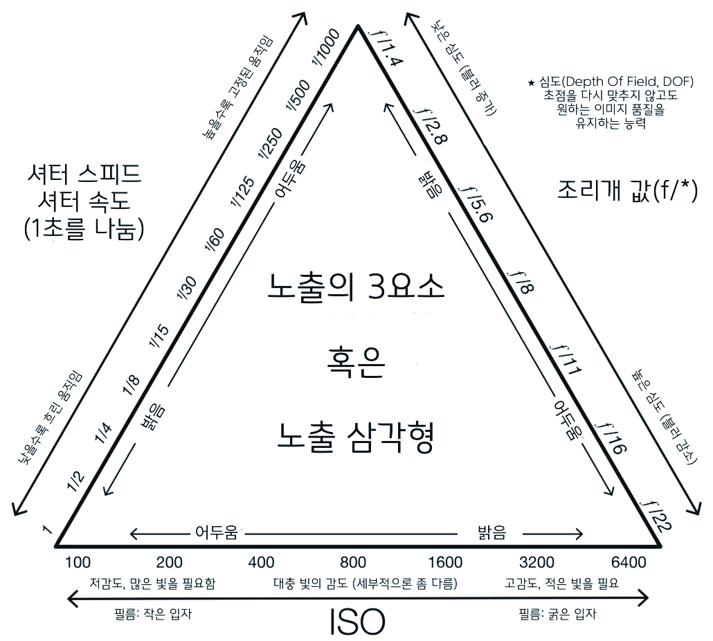
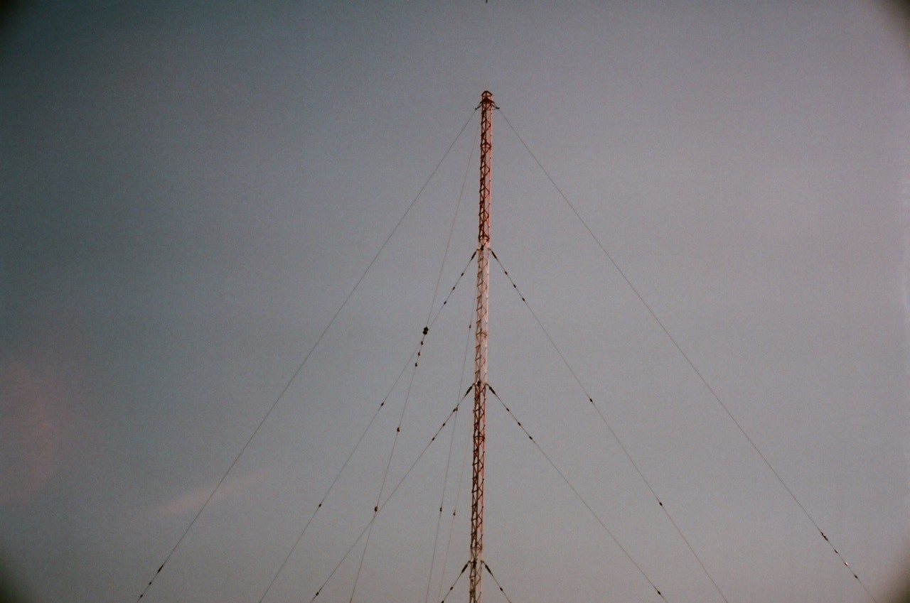
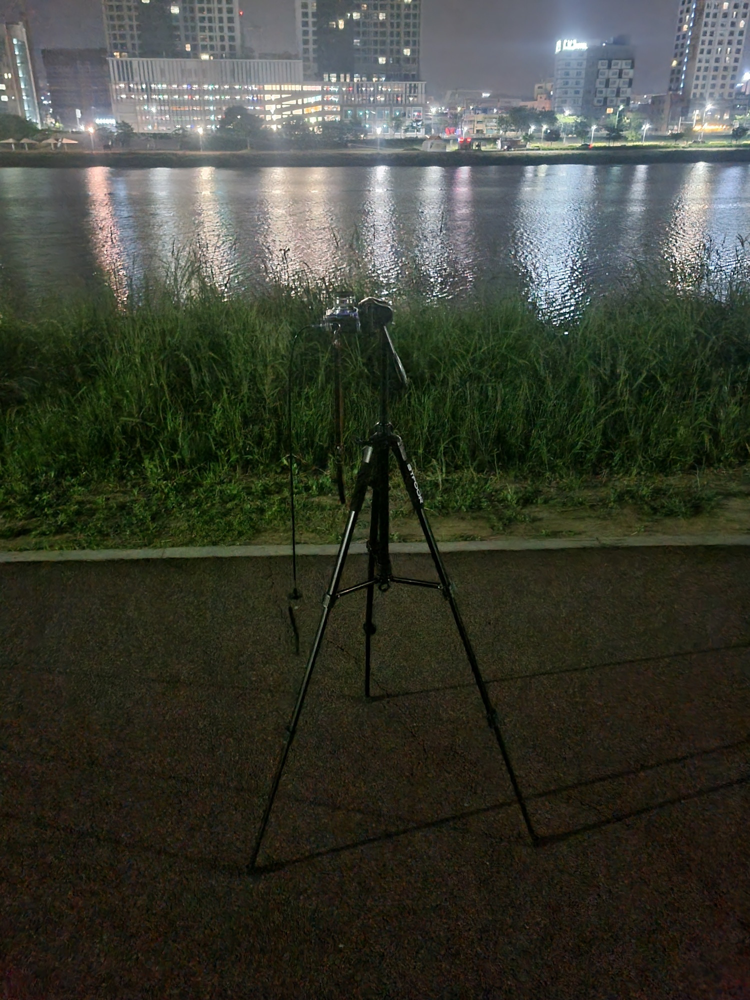
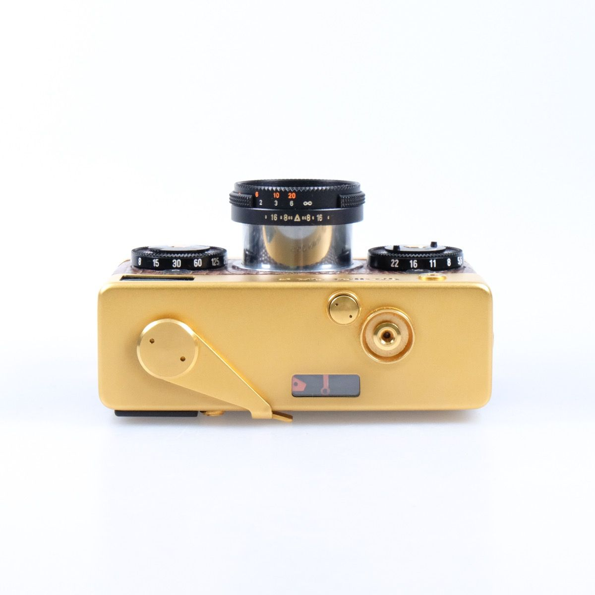
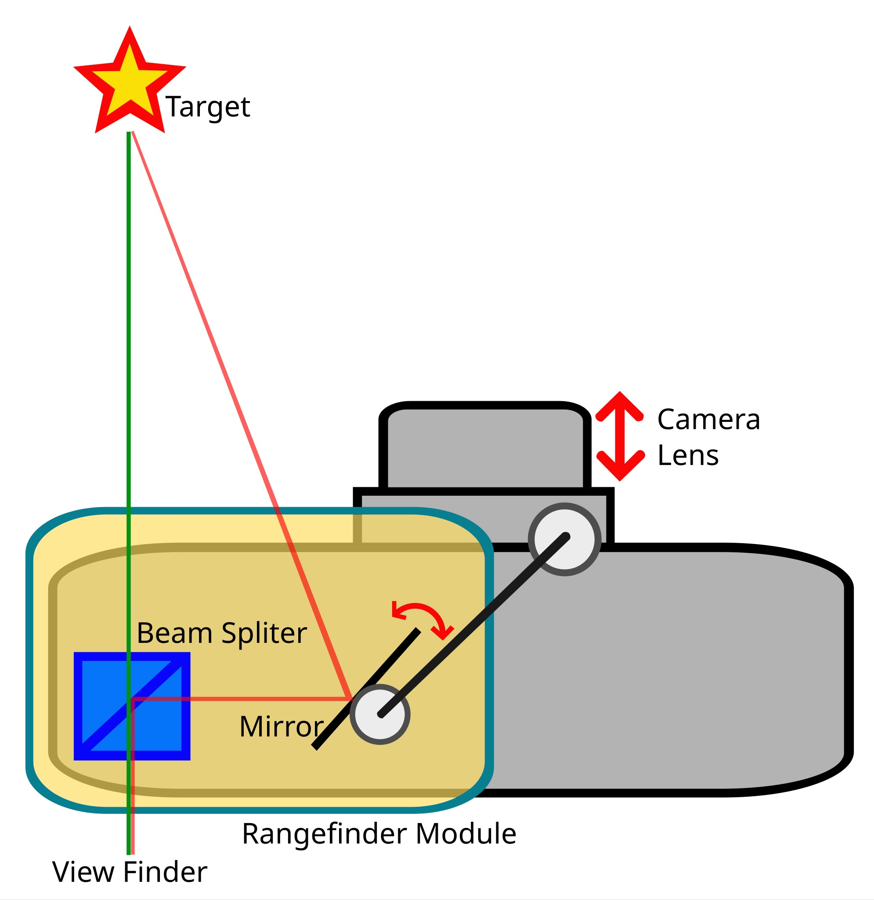
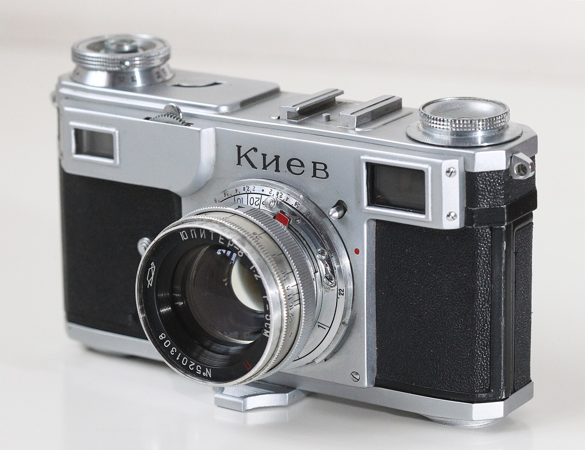
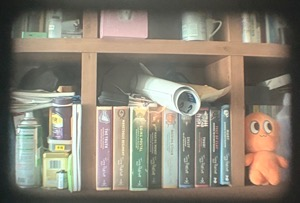
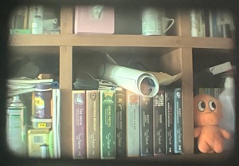
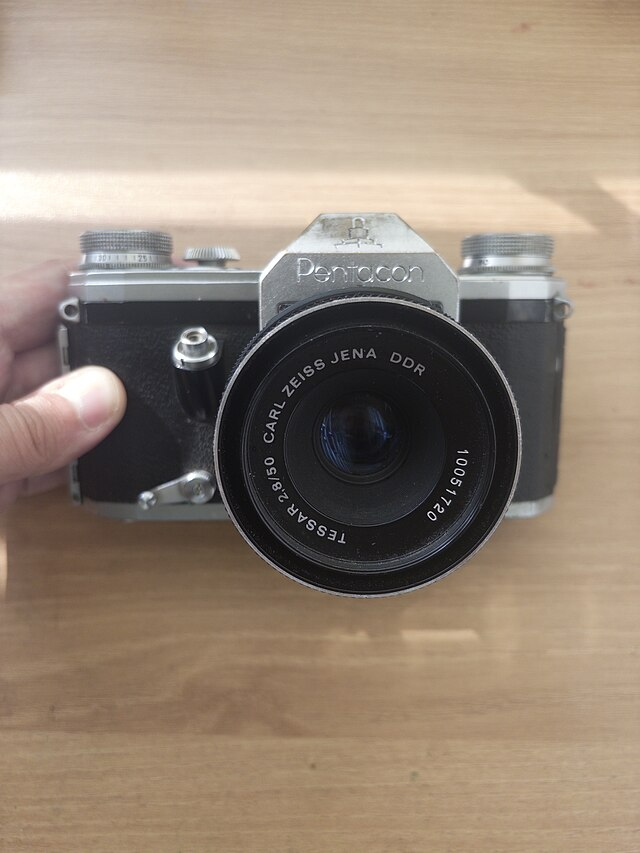

사진기초
===================================

노출 삼각형
-----------

위의 삼각형은 자동 모드가 아닌 경우, 특히 MF(Manual Focus) 모드를 사용할 때 알아두면 좋습니다.

처음엔 모든 값을 다 맞춰야 했습니다. 필름의 경우엔 필름에서도 말할것이지만, ISO가 고정되어 있었죠. 그 후 황화카드뮴(CdS)로 만든 포토 레지스터로 인해 자동노출이 가능해졌습니다. 노출계 쪽은 기타에서 언급할 겁니다.

디지털의 경우엔, 센서 자체(CMOS, CCD)가 빛을 받아들이니까 자동이죠.

사실 다 안알아도 상관은 없습니다. 방향만 알아도 괜찮은것이 나오니까요.

노출값, EV에 관한건 `기타 <https://photo-technic-tmi.readthedocs.io/ko/latest/기타.html#exposure-value-ev>`_ 페이지의 내용을 참고해주세요

상반칙불궤
---------------
**Reciprocity law Failure, Reciprocity**

이 문제는 평상시 사진에선 나타나지 않습니다. 그러니까 이런 경우에만 생기는 문제에요

#. 셔터스피드가 1/1000 이상인 경우
#. 셔터스피드가 1초 이하인 경우

그러니까, **간단하게 지수 형태로 가던 것이 깨지는 걸 말하는 겁니다. 이 현상은 위의 노출 삼각형을 파괴합니다.** 그래서, 노출계등에서 실제 계산된 값으로 찍으면 노출부족으로 떠서 사진이 망한다는 것이지요.

첫 번째 예의 예시가 이겁니다.

이 사진은 ISO 125, f/16, 1/1250으로 찍었습니다. 쨍쨍한 낮이고, 호미곶에 있는 라디오 타워입니다. 근데, 생각하면 f/16까지 찍었으면 밝아야 정상이 아닌가 하는데, 네... 참고로 이런 1/1000 문제는 평상시엔 거진 없기 때문에 계산기가 없어요.

두번째는 아래 장노출에서 머리가 아픈 1초 이상의 찍을때 발생하는 문제입니다. 이건 독일의 물리학자인 카를 슈바르츠실트(Karl Schwarzschild)가 만든 슈바르츠실트 법칙이 있습니다. 천문대에서 장노출 사진을 찍는데 제대로 안나와서 만든 법칙이에요.

근데, 이 이름으로 검색하면 매우 빡셉니다. 이 사람이 살았던 당시, 아인슈타인이 상대성이론을 제시하고 혹시나 이런 별(현재 이 별을 블랙홀이라 부르죠)이 있지 않을까 해서 '아 그래, 내가 그거 한번 계산해야지' 하면서 슈바르츠실트 블랙홀, 슈바르츠실트 반지름 등등... 블랙홀만 주구장창 나올겁니다.

.. math::
   :nowrap:

   \begin{eqnarray}
      E=It^p \\
   \end{eqnarray}

여튼 슈바르츠실트가 만든 이 식에서는 p 값이 0.86으로 찍었으나, 현재 p값이 바뀔수 있다는걸 알게 되었습니다. 노출효과 = 조도 곱하기 시간의 제곱에 슈바르츠실트 상수가 들어가는 식이죠.

장노출 찍는 법
---------------
장노출 어케하면 잘 찍습니까? 주간 장노출의 경우엔 이런게 필요하겠죠. 일단, 찍으러 다 준비하기 전에 상반칙불궤 내용을 봐주세요. 1초를 넘지 않으면 상관없지만, 1초 넘으실거라 중요합니다.

#. 벌브혹은 B가 적혀있는 카메라, 혹은 프로그램을 자유자재로 바꿀수 있는 카메라. MF라고 하죠? 오래된 카메라의 경우엔 T 모드(Time, 제 Contax IIa 카메라를 보면, 이 T모드에서 셔터를 닫을려면 속도 다이얼을 돌려야 합니다)란게 있습니다.
#. 셔터 릴리즈 케이블 - 당연히...
#. 적절한 높이의 삼각대 - 너무 낮으면 찍기 힘들겠죠?
#. 노출계나 노출계 앱 - 제원을 넣으면 알아서 계산해주는 앱도 있습니다.
#. ND 필터 같이 조리개 값을 올릴수 있는 필터 (밝은 대낮 환경)

`아날로그 노출계 보는 법 <https://photo-technic-tmi.readthedocs.io/ko/latest/기타.html#id3>`_ 은 이걸 참고하시고, 필름의 경우엔 이런게 힘들다는겁니다 - 필름은 ISO가 정해져 있으니 말이죠.

야간 장노출 - 천체 사진등
*************************
그러나, 필름도 야간엔 수고를 덜하면서 찍을수 있죠.

#. 벌브 혹은 B가 적혀있는 카메라, 혹은 프로그램을 자유자재로 바꿀 수 있는 카메라. MF라고 하죠? 오래된 카메라의 경우엔 T 모드(Time, 제 Contax IIa 카메라를 보면, 이 T모드에서 셔터를 닫을려면 속도 다이얼을 돌려야 합니다) 란게 있습니다.
#. 셔터 릴리즈 케이블
#. 적절한 높이의 삼각대 - 너무 낮으면 찍기 힘들겠죠?
#. 노출계나 노출계 앱 - 제원을 넣으면 알아서 계산해 주는 앱도 있습니다.
#. 찍고 싶은 대상이 천체라면 천문 시간, 그러니까 천체사진은 달이 없는 시간이 좋고, 달이 있어도 천문 박명이 시작 되야 별이 드디어 보입니다. 그리고 내가 찍고자 하는 별이 어디있냐 하는 천구를 보여주는 앱도 좋습니다. 태화강 둔치에서 90도로 찍은 적도 있네요. 

사진은 2025년 5/28일 새벽 2시 즈음에 천체사진 찍다 찍은 사진입니다. 필름의 경우, 노출 시간이 몇 분이 될수도 있기 때문에 셔터 릴리즈 케이블이 짧아도 있는게 좋아요.

필름의 경우 디지털보다 노출에 시간이 오래 걸릴 수 있으며(필름 ISO 125에서 한 5분 정도 기다리는 것 vs 금방 찍고 나가는 것), 반대로 디지털의 경우 진심으로 천체사진을 찍고자 한다면 돈을 더 들여야 할지도 모릅니다. 열로 발생한 센서 노이즈를 제거해 줄 펠티에 냉각기가 필요하니 말이죠.

펠티에 냉각기의 효과는요? 엄청납니다. 천문대 같은 곳에선 CCD에 액체 질소를 흘려 넣어 이 문제를 해결합니다. 현재 세계에서 제일 큰 CCD, 그러니까 천문대에 장착된 놈이 액체질소로 -160도를 유지한다고 하네요. 그리고 논문을 뒤져보면 CCD를 어케 액질할까... 란 논문도 많구요. 여어튼 천문대 레벨까지 가기는 힘든 문제인지라 타협을 봐서 펠티에 냉각기를 사서 센서 뒤에 두고 있는것이죠.

상을 맞추는 여럿 방법
------------------------
현대 쓰였거나, 혹은 지금도 쓰이고 있는 방식들입니다. 몇 가지가 있네요.

존 포커싱
*****************************************
위의 삼각형을 이용하는 겁니다. 조리개의 피사계 심도를 이용해서, 피사체가 있을법한 초점 '영역'을 예상하여 수동으로 설정하는 것이죠. 인터넷등의 DOF 계산기가 이런 존 포커싱 계산기라고 할 수 있겠네요.

목측식 카메라 & 뷰파인더 카메라
*********************************************

이건 영국 엘리자베스 2세 여왕의 카메라 모델중 하나였던 롤라이 35s 24K 금질 플레이트 에디션입니다. 와 비싼것 썼네는 둘째고, 렌즈쪽을 보죠. 보시다시피 렌즈가 돌릴수 있게 되어 있는데, 주황색으론 미국을 제외한 국가에선 미터법으로 법적으로 묶여있는 야드파운드, 그리고 하얀색으론 미터가 적혀 있는걸 볼수 있습니다. 그리고, 렌즈 아래에선 존 포커싱을 위한 숫자가 적혀져 있구요.

목측식은 사진처럼 초점 잡는 구조가 매우 단순합니다. 사진의 롤라이 35는 거리 조절을 사람이 머릿속으로 계산한 후에(물론 액세서리로 슈에 꽂는 소형 레인지파인더가 있지만 잠시 제하죠) 찍는 물건입니다. 그래서 숙련되어 내뇌 레인지파인더가 장착되면 바로 자동 거리 조절이 가능하지만, 그게 힘든 사람들도 존재 한다는게 문제죠. 목측식도 레인지파인더로 분류하는 사람들이 있긴 합니다. 거리는 머리 속으로 계산해야 하니 말이죠...

레인지파인더 카메라
*******************

기본 메커니즘은 다음과 같습니다. 직각 삼각형 부분이 중요하고, 이를 이용해 렌즈를 움직이는 거죠

이 방식의 거리 측정은 직각 삼각형을 생각하시면 편합니다. 우린 정면으로 사물을 보고 있고, 내 쪽의 각을 알면 저 멀리 있는 것의 각이 나오고, 그렇게 거리를 측정하는 삼각측량을 이용한 일치식 광학 레인지파인더(거리 측정기)를 사용하는 카메라입니다.

처음엔 연동되지 않았지만, 연동을 하게 되었고, 후에 빔 스플리터를 활용해서 레인지파인더와 뷰파인더를 합체시켜 버렸죠.

사진의 카메라는 전쟁 배상금으로 자이스 드레스덴 공장을 털고 간 소련이 현 키이우(키예프)에 세운 카메라 공장에서 나온 Kiev 2입니다. 이 모델은 오래되면 오래될수록 자이스 부품이 들어갈 확률이 높아 비싸죠. 렌즈를 보면 무슨 로고가 있는데, 소련제는 이렇게 로고를 박아 이를 만든 회사를 확인할 수 있습니다. 살펴보자면 현 러시아 연방의 KMZ에서 만든 주피터 8(Sonnar f/2를 소련식으로 고친) Red P 렌즈군요.

1960 ~ 70년대에 유행이었다가 지금은 극소수(예를 들어 라이카... 라이카...)밖에 남지 않은 카메라군요.

레인지파인더 카메라의 이중 합치
^^^^^^^^^^^^^^^^^^^^^^^^^^^^^^^
여긴 디지털 라이카쪽과 연결되기에 좀 더 설명을 하죠. 일단 촬영한 카메라는 그 당시 프레임 표시도 없던 구형 Contax IIa 란걸 밝힙니다. 참고로 합체되지 않은 라이카 바르낙과 아거스 C3(Argus C3)는 먼저 레인지파인더 정렬을 하고 뷰파인더를 보고 찍어야 합니다.

맨 윗 그림을 보면 빛이 2개 들어오는 걸 볼 수 있습니다. 거리가 잘못되면, 사진 중간의 노란 부위(이 카메라는 실제로 금도금을 했지만 다른건 페인트질이나 아님 셀로판지로 바르기도 했습니다)에서 나타나는데, 달력과 왼쪽의 달력과 비슷한 모습을 보이는 것을 볼 수 있습니다. 이 중간을 보고 거리를 잽니다.

이건 거리를 제대로 맞춘 것입니다. 칼각이 아니면 이정도면 맞습니다. 물론, 이 카메라의 렌즈는 늙어서 초점거리가 1m 이내가 되지 않도록 설계되어 있습니다.

라이다 등 기타 레인지파인더를 이용한 카메라
*********************************************
이런 레인지파인더 카메라는 매우 드물지만, 위의 레인지파인더 카메라와 차이가 나기에 뺐습니다. 최근에는 한 놈이 나왔으니 적어보죠. Rollei 35 AF는 최근에 펀딩이 성공한 카메라입니다. 여기엔 라이다가 들어있습니다. 기타 중국제 노출계에서 이 레이저 레인지파인더를 넣기도 합니다. 물론, 더 프리미엄을 붙여서 받죠.

RIDAR(LIght Detection and Ranging)는 물체에서 반사되는 레이저 펄스를 방사하여 센서 주변의 구조를 이해하는 기술로, 보통 적외선 레이저를 사용하며 최근 컴퓨터 연산능력의 발달로 인해 많이 쓰이는 기술입니다. 예를들어 제일 쉽게 접할수 있는게 아이폰의 라이다 스캐너군요. 레이저로 주변을 다 스캔하는 방식으로 작동하죠. 그래서 레이저 경고가 삽입되어 있습니다. 디지털 카메라의 경우, 아이폰 고급기종의 경우 라이다를 장착하는 경우가 있는데 필름 카메라에선 아마 이 Rollei 35 AF가 처음일겁니다. 그러니까 현재 상태에서는 최첨단 기술이란거죠.

.. image:: images/Missouri.jpg
 :width: 600
하는 광학식 레인지파인더는 레이저 레인지파인더가 개발된 이후로 바뀌게 됩니다. 사진은 일제가 항복문서에 서명한 아이오와급 전함인 미주리입니다. 이 전함 어디에 레인지파인더가 있냐면, 안테나 앞의 부분이 광학 레인지파인더 부분입니다.

 .. image:: images/ww2zeiss.jpg
 :width: 600
이걸 보병용 혹은 기갑용으로 축소하면 이런 크기가 되죠. 2차 세계대전때 칼 자이스 예나가 만든 카메라에서 사용하는 방식과 같은 레인지파인더 입니다. 이렇게 커다란 레인지파인더를 군용으로 사용했다가 레이저 레인지파인더가 개발되면서 작은 크기로도 정확도가 높으니 군사용으로 잘 쓰고있죠(포병의 제원 계산, 전차포 제원 계산등등)

라이다 이전을 보면, 지금도 쓰는 골프용(내가 쳐야 하는 거리가 몇 야드인가...) 레인지파인더란 것이 있었습니다. 레이저를 그 곳으로 쏘아 다시 돌아오는 레이저 파장으로 위치를 재는거죠. 그러나 이건 골프용이나 특정 목표에서나 가능하지(잔디밭같은 반사가 잘되는 정해진 목표물), 카메라에선 매우 힘듭니다. 일단, 레인지파인더 시스템에서 레이저 다이오드에서 나오는 빨간색을 찍힌다는 것 부터가 커다란 거부 요소기도 하고, 보통 카메라는 12 미터 이상을 무한대(보통 30미터 이상을 무한대로 잡는게 편하지만, 일단은 그리 처리합시다) 처리합니다. 그리고, 출력이 약한 레이저의 경우엔 12 미터를 날아가는 동안 빛이 소멸되어서 안 뜨기도 합니다. 풍경을 찍을려고 레이저 레인지파인더를 댔더니 아무것도 반사되지 않아서 난감했던 적이 있네요.

초음파를 이용한 방식도 있습니다. 요새 아이들의 코딩 교육용으로 잘 쓰이는 아두이노(Aduino)에 초음파 레인지파인더 센서가 있습니다. 박쥐를 따라한 건데, 정 방향에 있지 않으면 꽤나 힘듭니다. 그게 울퉁불퉁한 표면이면 더 힘들구요... 그리고 초음파지만 약간의 소리가 들릴수 있습니다.

그래서 현재로선 라이다가 제일 좋은 레인지파인더 요소라고 할수 있겠군요. 지금 차에서는 이 라이다를 이용하여 앞 차와의 거리등을 계산하여 운전자에게 추돌위협등을 경고합니다. 물론, 테슬라 같은 오직 카메라에 의존하는게 있지만, 이미 이를 속인 `사례 <https://www.youtube.com/watch?v=IQJL3htsDyQ>`_ 에 대한 유튜브가 존재합니다. 잘못하다가 사고 나는것보단 라이다 같은 다른 센서에 의존하는게 더 낫죠...

디카에서는 왜 별로 안 쓰나요? 디카 쪽은 잘 모르겠지만, 솔직히 지금 기술가지고 되는데, 굳이 라이다같은 최신 기술에 돈을 들일 필요가 있을까... 라는게 제 생각입니다. 아이폰 고급기종에서는 애플 비전등에서 사용할 수 있는 3D 정보 데이터를 얻기 위해서 라이다를 사용하죠. 그러니까 3D 정보 데이터를 제외하고, 실제로 거리를 구하는 것에서는 이 안내서와 마찬가지로 모가 집는데 스털링 실버 판을 이용하는 것과 아마 같을겁니다.

SLR - 일안 반사식 카메라
*************************

목측식이나 레인지파인더는 시차가 있습니다. 천문학에서 쓰이는 용어인데 이렇습니다.

**고정된 먼 배경이 존재하는 상황에서 한 물체를 서로 다른 위치에 있는 두 관측자가 관측했을 때 발생하는 겉보기 위치의 차이 또는 변위**

목측식이나 레인지파인더는 자연적으로 시차가 생기지만, SLR은 렌즈에서 들어온 빛을 넘겨주는 거죠. 사진은 VEB Carl Zeiss에서 개발한 Pantacon F입니다. 초기 펜타프리즘을 넣은 SLR 중 하나죠.