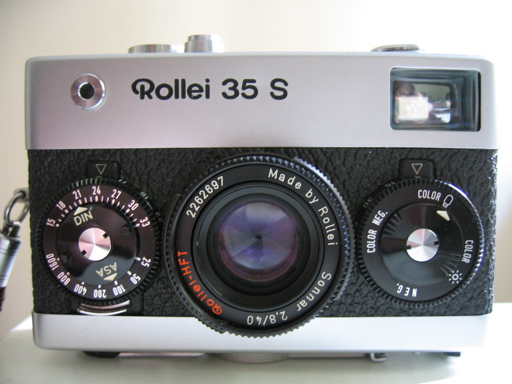

사진기초
===================================

노출 삼각형
-----------
.. image:: images/etriangle.jpg
 :width: 600

윗 삼각형은 자동 모드가 아닌 경우, 특히 MF(Manual Focus)모드를 사용할때 알아두면 좋습니다.

처음엔 모든 값을 다 맞췄어야 했습니다. 필름의 경우엔 필름에서도 말할거지만, ISO가 고정되어 있었죠. 그후 황화카드뮴(CdS)로 만든 포토레지스터로 인해 자동노출이 가능해졌습니다. 노출계에 대한건 기타에서 이야기 할 겁니다.

디지털의 경우엔, 센서 자체(CMOS, CCD)가 빛을 받아들이니까 자동이죠.

사실 다 안알아도 상관은 없습니다. 방향만 알아도 괜찮은것이 나오니까요.

노출값, EV에 관한건 `기타 <https://photo-technic-tmi.readthedocs.io/ko/latest/기타.html#exposure-value-ev>`_ 페이지의 내용을 참고해주세요

상을 맞추는 여럿 방법
------------------------
현대 쓰였거나, 혹은 지금도 쓰이고 있는 방식들입니다. 몇가지가 있네요.

존 포커싱
***********
위의 삼각형을 이용하는 겁니다. 조리개의 피사계 심도를 이용해서, 피사체가 있을법한 초점 '영역'을 예상하여 수동으로 설정하는 것이죠. 인터넷등의 DOF 계산기가 이런 존 포커싱 계산기라고 할 수 있겠네요.

뷰파인더 카메라 & 목측식 카메라
***************

 이 방식은 초점 잡는 구조가 매우 단순합니다. 저 롤라이 35는 거리 조절에 필요한 기타 장비가 필요하지 않아요. 그래서 숙련되면 자동 거리조절이 가능하지만, 그게 힘든 사람들도 존재한다는게 문제죠. 여튼 목측식도 레인지파인더로 분류하는 사람들이 있긴 합니다. 거리는 머리속으로 계산해야 하니 말이죠... 미러리스는 거진 목측식(거리도 재주고 다 재주는 그런 좋은...)으로 볼 수 있겠군요

레인지파인더 카메라
***************
.. image:: images/Kiev-II.jpg
 :width: 600

 직각 삼각형을 생각하시면 편합니다. 우린 직각으로 사물을 보고 있고, 우리쪽에 있는 각을 알면 저 멀리 있는 것의 각이 나오고, 그래서 거리를 측정하는 삼각측량을 이용한 일치식 광학 레인지파인더(거리 측정기)를 사용하는 카메라입니다.

 처음엔 연동되지 않았지만, 연동과 동시에 빔 스플리터를 활용한 레인지파인더와 뷰파인더를 합체시켜 버렸죠.

 사진의 카메라는 전쟁 배상금으로 자이스 드레스덴 공장을 털고 간 소련이 현 키이우(키예프)에 세운 카메라 공장에서 나온 Kiev 2 입니다. 이 모델은 오래되면 오래될수록 자이스 부품이 들어갈 확률이 높아 비싸죠. 렌즈를 보면 무슨 로고가 있는데, 소련제는 이렇게 로고를 박는걸로 원산지랑 위치를 확인할 수 있습니다. 굳이 살펴보자면 KMZ에서 만든 주피터 8(Sonnar f/2를 소련식으로 고친) Red P 렌즈군요.

 1960 ~ 70년대에 유행이었다가 지금은 극소수(예를 들어 라이카... 라이카...)밖에 남지 않은 카메라군요.

SLR - 일안 반사식 카메라
***************
.. image:: images/Pantacon_F.jpg
 :width: 600

 목측식이나 레인지파인더는 시차가 있습니다. 천문학에서 쓰이는 용어인데 이렇습니다.

**고정된 먼 배경이 존재하는 상황에서 한 물체를 서로 다른 위치에 있는 두 관측자가 관측했을 때 발생하는 겉보기 위치의 차이 또는 변위**

목측식이나 레인지파인더는 자연적으로 시차가 생기지만, SLR은 렌즈에서 들어온 빛을 넘겨주는 거죠. 사진은 초기 펜타프리즘을 사용한 VEB Carl Zeiss 에서 개발한 Pantacon F 입니다.

