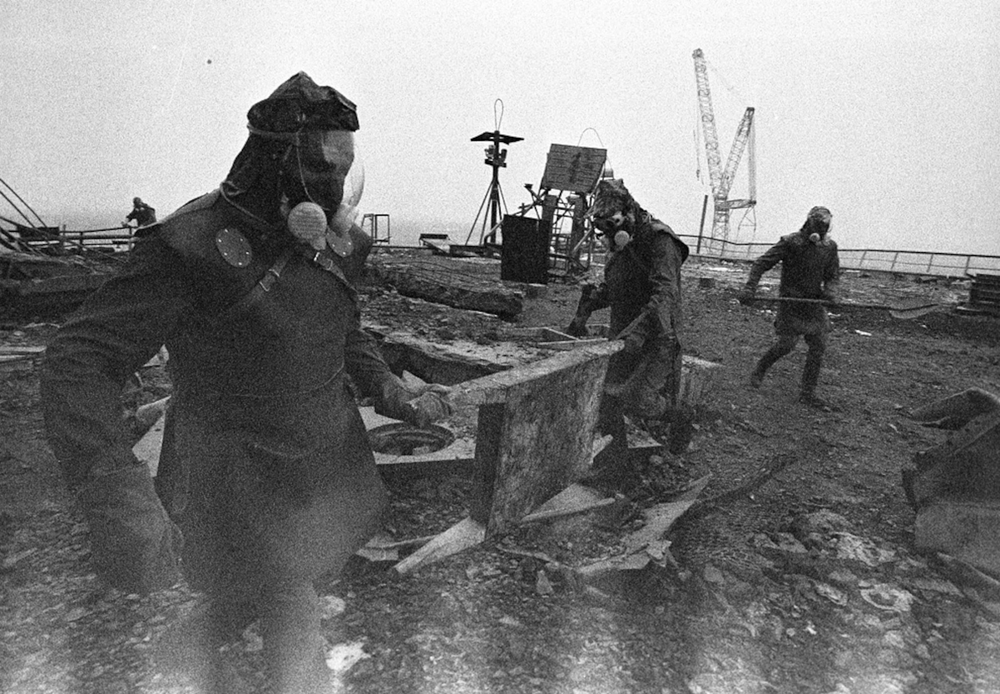
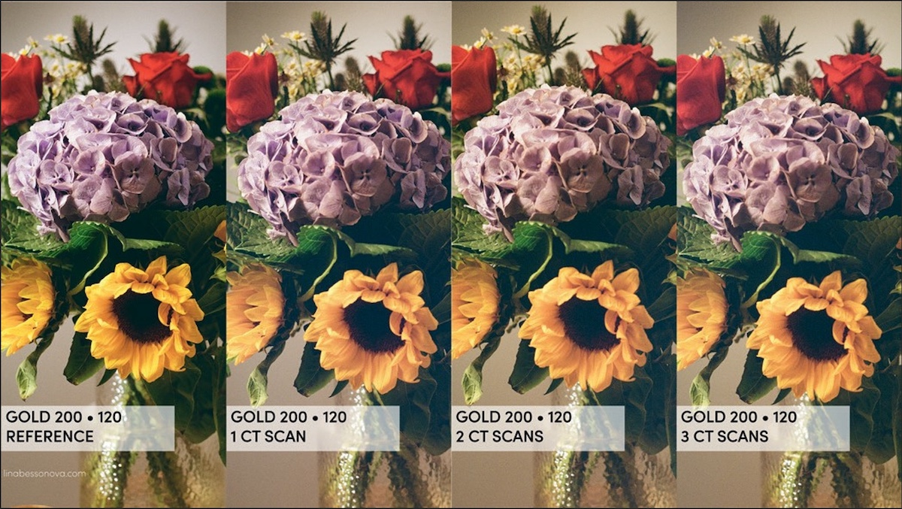
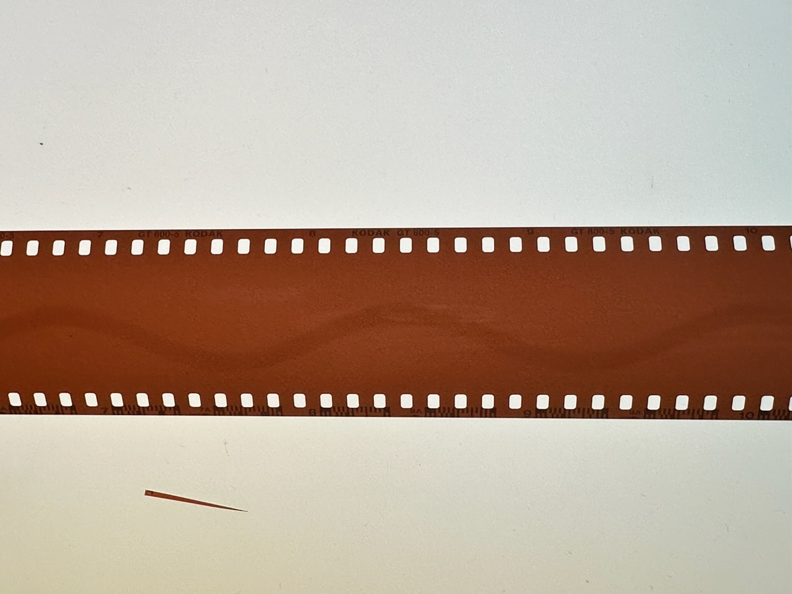
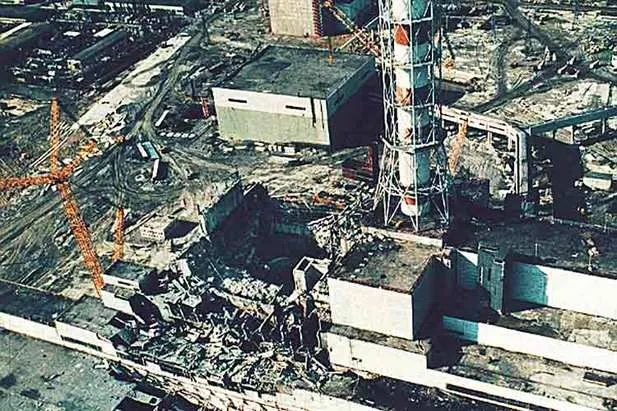
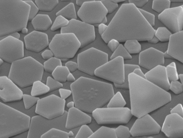
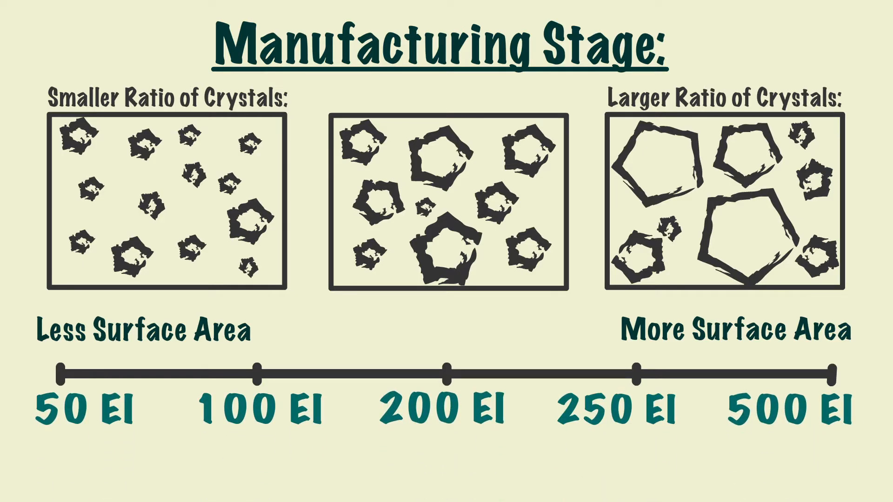
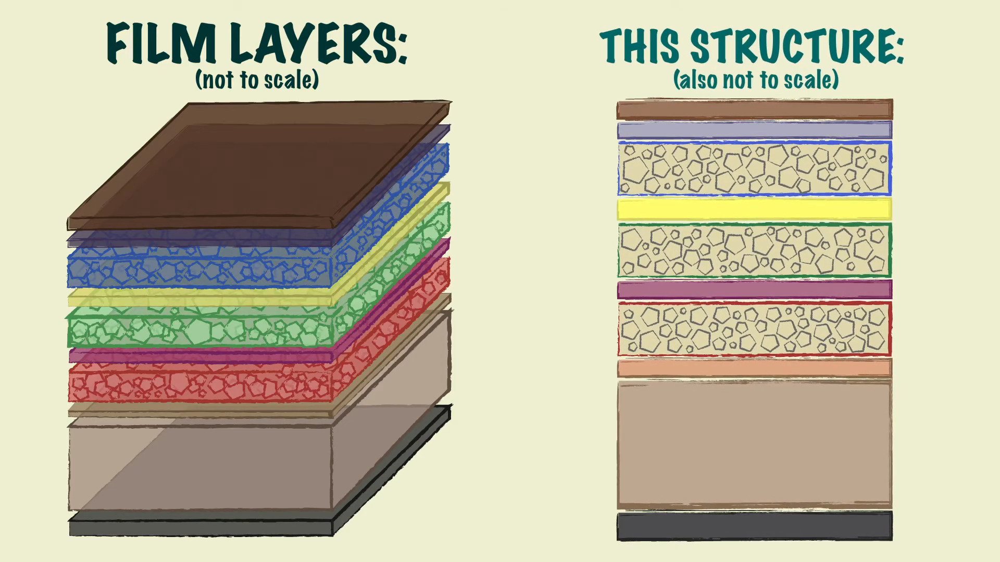
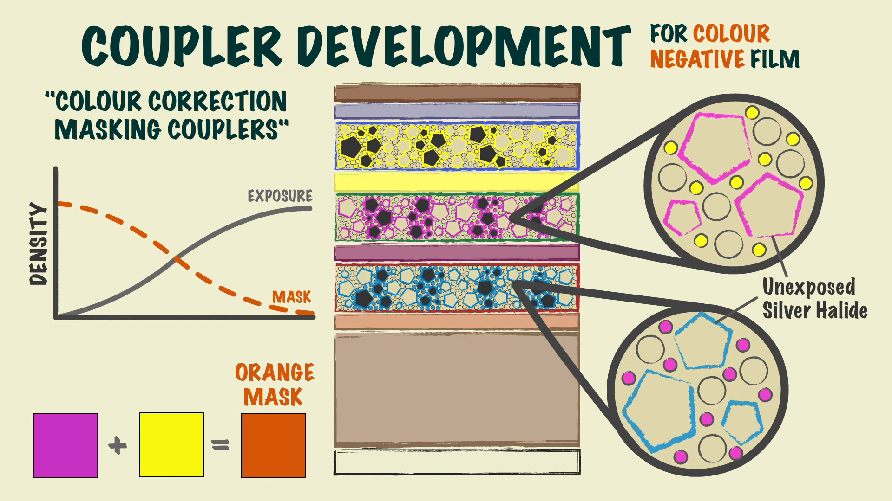
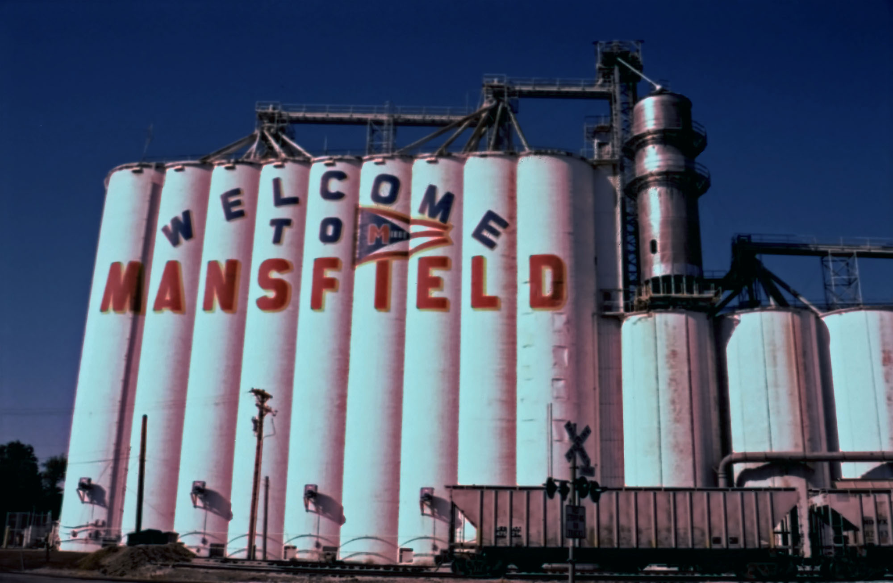

필름
===================================

필름은 어떻게 사진을 기록합니까?
-------------------------------
과학적인 설명으로 머리를 지끈하게 해야 겠군요. 할로젠화 은이란게 있습니다. AgCL, AgBr 등등이 있는데, 할로젠족 원소들이 붙어서 만들어지는 화합물입니다. 이 화합물들은 에너지 장벽 이상의 에너지를 받으면 화학반응이 벌어지게 됩니다.

여기서 에너지는 전자볼트를 사용합니다. 이 단위는 입자의 에너지나 무게를 측정하는 단위로, 1 eV의 경우, 1 볼트의 에너지를 가진다고 보시면 됩니다.

여튼, 가시광선의 경우 1.6 eV ~ 3.26 eV 정도의 에너지를 가집니다. 그리고 잘 쓰이는 브롬화 은의 경우, 2.7 eV 이상의 에너지를 받게 되면 화학반응이 일어나게 되죠. 최근엔 양자역학등으로 에너지가 더 낮아도 감광되게 만드는 기술이 개발되었습니다.

컬러 필름의 경우엔 은도 중요하지만, 염료를 자유롭게 하여 염료 커플러를 형성합니다. 여기서 중요한 것은 은이 이온화 되기 전에 염료 커플러를 만들어야 한다는 거죠. 그후에 하이드로퀴논 같은 환원제로 은염으로 변경시킨후 은을 제거합니다.

필름의 경우 이런 화합물들과 층을 고정시키기 위해 젤라틴을 오랜기간 동안 사용(사용연한이 여기서 만들어집니다)하고 있습니다. 젤라틴의 경우 물리적으로 할로젠화 은을 보호함과 동시에 이를 고정시키는 역할을 합니다. 이게 없는 틴타입의 경우, 은이 흘러서 한 부분이 망하는 경우가 있지요.

은을 사용하는 특성상 흑백의 경우, 1 제곱미터당 0.9g 의 은을 회수할 수 있습니다. 물론, 다른 필름들은 더 높을수도 있습니다. X선 필름의 경우엔 양면에 코팅을 하는터라, 1 제곱미터당 18그램 정도 한다더군요.

필름과 방사선, 공항 수검사
---------------------------------------------------
필름 사진으로, 방사선에 대한 극적인 사진중 하나를 꼽으면 이게 있겠군요.

여기서 흑백 필름을 쓴 이유는, 필름중에서 흑백이 제일 방사선에 가장 잘 버티기 때문입니다. 당시 소련도 사람은 안보내야지 생각을 해서 우주 탐사용 로봇을 폭발한 4호기 위로 보냈는데, 방사선으로 인해 전자 회로가 펑하자(덤으로 현대 방호 기술로 만든 RAD750 이란 우주탐사선에 넣는 CPU도 이 정도에선 30분 작동이 최대입니다) 사람을 보내 시간 재면서 작업을 했고 이걸 사진기자가 올라가 찍은 사진입니다. 당시 사진기자가 들고 있던 니콘 전자 제어식 필름 카메라는 당연히 터졌다고 하네요. 그 위에서 찍은 사진은 방사선에 의해 손상이 많이 되어 사진도 매우 거칠어 보이고, 아래 무늬가 남게 되었죠.

이런 이유 등으로 필름을 금속 캐니스터에 보관하는 것이지요. 다른 예로는 트리니티 테스트란 인류를 바꾼 사건이 있습니다. 원자력안전위원회 공무원도 몰랐던 그런 듣도 보도 못한 핵실험인데, 이젠 오펜하이머 영화가 개봉했으니 이 실험이 뭔가 알겠지만 말이죠. 여어튼, 당시엔 핵무기를 기폭하면 방사선이 생기는 것도 모르고 터트렸다가 X선 필름에 베크렐의 사진건판처럼 점을 하나씩 박았고, 이걸 보고 빡친 사람들은 코닥측에 바람처럼 달려가서 따졌습니다. 이에 대해 연구를 하던 도중에 이게 트리니티 테스트로 인해 발생되었다는게 알려졌지만, 이 사실은 오랜기간동안 입을 열지 않고 있다 최근에야 알려졌습니다.

왜 방사선에 대한 이야기를 하냐 하면, 최근 레트로 붐이 불어 필름 수하물 검사가 늘어났고, 공항 수하물 검사에 CT, 컴퓨터 단층촬영이 등장했습니다. 병원의 그 것 맞습니다. CT를 간단하게 설명하자면, X선 촬영 장비와 촬영당하는 것을 돌려 찍은후 그 이미지를 컴퓨터로 합성하는 시스템이죠. 확실히 물품을 찾을땐 좋지만, 그렇게 하면 강력한 X선으로 인해 내가 생각했던 필름 품질과는 망한 사태가 발생한거죠.

사진은 유럽의 한 블로그에서 ISO 200 필름을 암스테르담 공항의 CT 스캐너에 넣고 돌린 결과입니다.

아래의 경우, 공항 스캐너만 거친 필름입니다.

이런 고 X선 장비들이 등장해서 필름 쪽에선 해법을 찾고 있죠.

아마 그대로 검색대를 통과하게 되면 윗처럼 입자라던가 색이 바래게 되겠죠. 근데 저런거 어디서 보셨다구요? 위에서 다루고 아래서 보여드릴 체르노빌 원자력 발전소 사고당시의 컬러 사진의 이상함이 이런 이유거든요...

그래서 여럿 해법들이 나왔고 찾고 있습니다.

#. 현 대한민국 법으로는 ISO 800 이상은 수검사가 당연하게 법으로 지정되어 있습니다.
#. 국토교통부의 특별 보안검색 물품 허가 신청서를 작성후 탈려는 곳 공항에 보냅니다. 그러나 이게 공항마다 다르다라는 소리도 있습니다.
#. 수화물로 부치면 저렇게 CT 같은 강력한 X선을 쓰기 때문에 **무조건** 필름을 들고 타야 합니다.
#. 왠만하면 `코닥에서 만든 이걸 투명백에 붙이고 <https://www.kodak.com/content/products-brochures/Film/H-512-Do-Not-X-ray-6-Up-Shipping-Labels-A4.pdf>`_ 필름을 넣어 수검사 받는게 좋습니다.
#. 사족으로, 전 무게가 많이 나가는 방법을 생각했습니다. 일단, 미국 미시건이나 플로리다의 경우 최소 1/16 인치, 그러니까 1.65mm 의 납판을 대도록 강조합니다. 이거 관련 회사는 1.8mm의 납을 강조합니다. 왜 이렇게 강조하는 이유는 이게 여럿 `국가규격 <https://indico.cern.ch/event/670810/contributions/2808032/attachments/1572009/2480510/JM_Shielding.pdf>`_ 으로 설정해놓은 수치(5페이지를 보세요)기 때문이죠... 참고로, 벽돌로 치자면 2mm의 납은 23cm의 꽉꽉찬 벽돌과 유사하다고 합니다. 물론, 무게는 좀 나가지만 말이죠... 어떻게 만들었냐구요? 낚시에서 무게추로 사용되는 납은 쌉니다. 그래서 이리저리 합쳐서 2mm 박스를 만들었죠...

필름은 디지털 픽셀과 같나요?
-----------------------------
글쎄요... 거진 사진계의 부먹/찍먹 문제이긴 합니다만, 안으로 들어가면 머리가 아프죠

일반 사진 필름(흑백 필름. 코닥의 T-Max)의 전자 현미경 사진을 보죠. 디지털카메라의 CMOS나 CCD와는 매우 다르다는 걸 볼수 있습니다. 필름 제작회사에서도 할로젠화 은 화합물에 따라서 이런 결정들 모습이 달라지는 걸 알고있고, 그리고 또한 화합물의 결정모습에 따라서도 또 바뀔수도 있습니다. 그래서 필름을 딱 떼어서 한 픽셀당이라고 하긴 참 그렇습니다.

당연하게 필름을 디지털 스캔한 것의 해상도는 설명할 수 있을수 있지요. 필름의 경우, ISO/그레인 등등 여러 제약들이 디지털에 비해 많이 있습니다. 저런 화학물질로 구성되어 있기에 운이 있는 편이죠.

필름에서의 ISO는 뭡니까?
-----------------------------------
`노출 삼각형 <https://photo-technic-tmi.readthedocs.io/ko/latest/사진기초.html#id2>`_ 아래의 ISO에서 대충 빛의 감도하면서 세부적으로 다름이라고 적어놨었죠?

일단 위에서 할로젠화 은을 이야기했습니다. 이건 화학물질이고, 어느 빛이든 닿이면 감광되는 터라 금속 캐니스터에 담아야 합니다.

그래서 필름의 ISO란 뭘까요?

그림을 봅시다. 공장에서 ISO 800 만들거야! 125 만들거야! 라고 설정해서 만듭니다. 크게 만든다면 빛을 더 많이 받을수 있도록 결정 크기를 늘려버립니다. 반대로, 빛을 더 적게 받고 싶다면 결정 크기를 줄이는 것이 답이죠.

결정 크기는 또한 필름의 입자와 깊은 연관이 있습니다. 확실히 결정이 크면 입자가 크게 보일 것이고, 결정이 작다면 고르게 잘 보이겠죠.

컬러 필름의 구조는 어떻게 되어 있나요?
-----------------------------------
이런 코팅으로 인해 코닥이 은 코팅 같은 여럿 화학사업을 하는거죠...

사실 스케일로 보자면, 이것들은 코팅이기 때문에 매우 얇은 막을 구성하고 있습니다. 옆에서 보다시피 마젠타, 시안, 옐로 염료 커플러들이 있는데, 이것들은 인쇄를 위한 CYMK 컬러 프로파일입니다. RGB는 들어봤는데 CYMK요? 디카를 인쇄하거나, 컬러 책을 보거나, 신문을 인쇄하거나에 사용되는 색상입니다. 하나 빠진 K는 블랙입니다.

이 그림을 가져온 곳이 영화 필름 유튜브라서 아래 램젯 층이 있습니다. 이 층은 영화 촬영중 반사를 막아주거나 혹은 영사기에서 빠른 속도로 돌릴 때 필름을 보호해 주는 역할을 하죠.

아래는 특정 필름(Kodak Aerocolor IV)엔 없는 색 보정 부분입니다. 그러니까, 이게 없으면 매우 붉어지기 때문에 이를 중화시키는 역할이라고 보시면 되겠습니다. 반대로 이것이 없는건 이 필름이 특정한 목적, 그러니까 고고도 촬영(보통 2km 이상)에서 찍어서 이를 현상하기 때문 때문이라 보시면 되겠군요. 그러니까, 연구소나 군등 필름을 사는 단체들 뒷골이 아파온다는 이야기죠.

현재 필름의 주 현상 공정은 몇개인가요?
-----------------------------------
흑백은 D-76공정이 있고, 회사들마다 또 다른 공정들이 있는데, 보통 다음 공정들을 주로 사용합니다. 다 코닥에서 개발한 것들이군요.

#. D-76 Procerss - 코닥에서 만든 흑백 현상. 영화용은 더 빠르게 할 수 있는 D-96이 있음.
#. C-41 Process - 코닥에서 만든 일반 사진용입니다. 에어로컬러도 C-41로 현상되죠
#. ECN-2 Process - 코닥에서 만든 영화용 현상 방법. 램젯을 없애야죠?
#. E-6 Process - 코닥에서 만든 포지티브, 그러니까 슬라이드 등에 넣는 필름들을 현상하는 프로세스입니다.

그러면 현상 공정으로 장난칠수 있죠?
---------------------------------------------
장난 혹은 원래 넣어야 할 필름을 다른 공정을 사용하는 것을 가리켜 크로스 프로세스라고 부릅니다. 예술 사진이나 장난을 치고 싶으시다면 이걸 추천 드리죠. 색깔이 재미있게 나는 경우도 있습니다. 물론 현상소 측에서는 싫어할 수 있습니다. 실수로 만들어진 기법이라고 볼 수 있겠군요.

사진은 E-6 필름(포지티브 필름 혹은 슬라이드 필름)을 C-41 프로세스에 넣은 크로스 프로세스 사진입니다.

상품명만 바꾸는 필름
-----------------------
현재 필름 업계는 매우 축소되어 있습니다. 이를 니치 마켓 혹은 틈새 시장이라고 하죠... 그래서 필름을 판다는 회사는 많으나 OEM을 주거나(희망), 혹은 상품명 변경(절망)을 하는 경우도 있죠. 코닥 혹은 코닥 알리아스, ORCW, 포마(체코의 흑백필름 생산업체입니다)등이 보통 이런 회사들에게 상품을 제공합니다.

예를 들어, 후지필름의 최신 ISO 200 필름은 일본이 아닌 미국 뉴욕주의 로체스터란 도시에서 찍어냅니다. 여기엔 코닥 본사와 코닥 공장, 코닥 알리아스(코닥 영국 지사였다가 소비자용 필름쪽을 분사해서 나갔기에 코닥이란 이름은 공유합니다)공장이 있죠... 산타 필름은 Kodak Aerocolor IV(원래 ISO는 125 입니다만...) 의 이름을 바꿔낸 제품입니다. 씨네스틸은 코닥 영화필름에서 램젯을 제거한 공정으로 찍어내죠.

그래서, 다양한 필름으로 특이한 맛들을 느끼고 싶으시다면, 해당하는 필름을 먼저 검색해 보시는걸 추천드립니다.

컬러 C-41 자체 현상하고 폐액 하수구에 부어도 되죠?
---------------------------------------------------
부으시면 제가 신고 넣어드리면 되겠죠? 산업폐기물 불법방류로 죄질이 매우 심합니다. 흑백이나 기타 등은 몰라도, C-41에 사용되는 CD-4(Color Developer agent 4)가 그 자체로 독극물이라, 인화하는 사진관의 폐액은 모두 산업폐기물로 분류됩니다. 버리는 것도 불법적인 것이니 죄질이 더 나빠지는 것이 되죠. 그러니 일단 기본적으로 구청에 들러서 물어봐야 합니다.

보통 구청에다가 버려달라고 하면 버려주기도 하고, 인화하는 곳에 좀 버려달라고 부탁하면 같이 버려주기도 합니다.